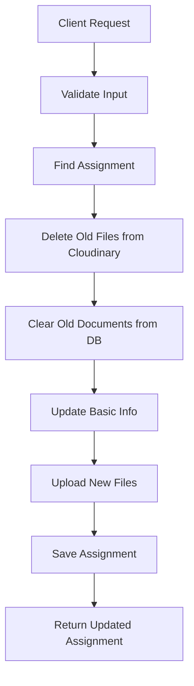

# ✅ Assignment Update With Files API - Complete Implementation

## 🎯 New Feature Added
Added API endpoint to update assignment information along with replacing all documents, similar to the lesson update functionality.

## 🔧 Implementation Details

### 1. **UpdateAssignmentWithFilesRequest DTO**
**File**: `UpdateAssignmentWithFilesRequest.java`

```java
@Data
@Builder
public class UpdateAssignmentWithFilesRequest {
    @Size(max = 200, message = "Title must not exceed 200 characters")
    private String title;
    
    private String description;
    
    @Min(value = 0, message = "Max score must be at least 0")
    private Float maxScore;
    
    private String dueDate; // ISO format: 2025-07-01T23:59:59
    
    private Boolean allowLateSubmission;
    
    private Boolean isPublished;
    
    // JSON string chứa metadata của documents
    private String documentsMetadata;
}
```

### 2. **API Endpoint**
**Controller**: `AssignmentController.java`

```http
PUT /api/assignments/{assignmentId}/update-with-files
Content-Type: multipart/form-data
Authorization: Bearer {jwt_token}
```

**Parameters**:
- `assignmentId` (Path): ID của assignment cần update
- `title` (Form): Tiêu đề mới (optional)
- `description` (Form): Mô tả mới (optional)  
- `maxScore` (Form): Điểm tối đa mới (optional)
- `dueDate` (Form): Hạn nộp mới, format ISO (optional)
- `allowLateSubmission` (Form): Cho phép nộp muộn (optional)
- `isPublished` (Form): Trạng thái published (optional)
- `documentsMetadata` (Form): JSON metadata cho documents (optional)
- `files` (Files): Các file mới thay thế (optional)

### 3. **Service Implementation**
**Service**: `AssignmentService.updateAssignmentWithFiles()`

**Workflow**:
1. **Find Assignment**: Tìm assignment theo ID
2. **Delete Old Files**: Xóa tất cả files cũ từ Cloudinary
3. **Clear Database**: Xóa records documents cũ từ database
4. **Update Info**: Cập nhật thông tin cơ bản
5. **Process New Files**: Upload files mới lên Cloudinary
6. **Save Changes**: Lưu assignment với documents mới

## 📊 **Comparison with Lesson API**

| Feature | Lesson | Assignment | Status |
|---------|--------|------------|--------|
| Update info only | ✅ | ✅ | ✅ |
| Update with files | ✅ | ✅ | **🆕 NEW** |
| Replace all files | ✅ | ✅ | ✅ |
| File validation | ✅ | ✅ | ✅ |
| Cloudinary cleanup | ✅ | ✅ | ✅ |
| Error handling | ✅ | ✅ | ✅ |

## 🔄 **Update Process Flow**



## 📁 **File Management**

### **Cloudinary Structure**
- **Assignment Files**: `lms/assignments/{assignmentId}/`
- **Strategy**: Delete entire folder, then recreate with new files

### **Database Relations**
- **Cascade Delete**: Old documents automatically removed
- **New Documents**: Created with new file info from Cloudinary

## 🛡️ **Validation & Security**

### **File Validation**
- ✅ **Max Files**: 10 files per request
- ✅ **Max Size**: 100MB per file
- ✅ **File Types**: All types supported (raw, image, video)

### **Input Validation**
- ✅ **Title**: Max 200 characters
- ✅ **Max Score**: Minimum 0
- ✅ **Date Format**: ISO format validation
- ✅ **Authentication**: JWT required

### **Security Features**
- ✅ **Authorization**: Teacher role required
- ✅ **Assignment Ownership**: Validate teacher owns assignment
- ✅ **Transaction Safety**: Rollback on errors

## 🧪 **Testing**

### **Test Script**
**File**: `test_update_assignment_with_files.ps1`

**Test Coverage**:
1. **Authentication**: Login with JWT
2. **Assignment Selection**: Find assignment to update
3. **File Creation**: Create test files
4. **Update Request**: Send multipart form data
5. **Verification**: Confirm changes applied
6. **Cleanup**: Remove test files

### **Test Scenarios**
- ✅ Update with new files (replace all)
- ✅ Update only basic info (no files)
- ✅ Update with mixed content types
- ✅ Validation errors (large files, too many files)
- ✅ Authentication/authorization errors
- ✅ Assignment not found errors

## 📝 **API Usage Examples**

### **Example 1: Update Title & Add Files**
```bash
curl -X PUT "http://localhost:8080/v1/api/assignments/123/update-with-files" \
  -H "Authorization: Bearer {token}" \
  -F "title=Updated Assignment Title" \
  -F "description=New description" \
  -F "maxScore=100" \
  -F "files=@document1.pdf" \
  -F "files=@document2.docx"
```

### **Example 2: Update Only Basic Info**
```bash
curl -X PUT "http://localhost:8080/v1/api/assignments/123/update-with-files" \
  -H "Authorization: Bearer {token}" \
  -F "title=New Title Only" \
  -F "isPublished=true"
```

### **Example 3: Replace All Files**
```bash
curl -X PUT "http://localhost:8080/v1/api/assignments/123/update-with-files" \
  -H "Authorization: Bearer {token}" \
  -F "files=@new_requirements.pdf" \
  -F "files=@new_template.docx" \
  -F "documentsMetadata=[{\"title\":\"Requirements\",\"documentType\":\"DOCUMENT\"}]"
```

## 🚀 **Response Format**

### **Success Response (200)**
```json
{
  "id": 123,
  "title": "Updated Assignment Title",
  "description": "New description",
  "maxScore": 100.0,
  "dueDate": "2025-08-15T23:59:59",
  "allowLateSubmission": true,
  "isPublished": true,
  "documents": [
    {
      "id": 456,
      "fileNameOriginal": "document1.pdf",
      "filePath": "https://res.cloudinary.com/...",
      "fileSize": 1024000
    }
  ],
  "createdAt": "2025-06-25T10:00:00",
  "updatedAt": "2025-06-25T11:30:00"
}
```

### **Error Responses**

**404 - Assignment Not Found**
```json
{
  "error": "RESOURCE_NOT_FOUND",
  "message": "Assignment not found with id: 123",
  "data": null
}
```

**400 - Validation Error**
```json
{
  "error": "VALIDATION_ERROR", 
  "message": "File 'large_file.pdf' is too large. Maximum 100MB allowed.",
  "data": null
}
```

**500 - Internal Server Error**
```json
{
  "error": "INTERNAL_SERVER_ERROR",
  "message": "Failed to update assignment: Connection timeout",
  "data": null
}
```

## 🔍 **Logging & Monitoring**

### **Log Examples**
```
INFO: Updating assignment ID: 123 with files
INFO: Deleting 3 existing documents for assignment ID: 123
INFO: Successfully deleted assignment folder from Cloudinary: lms/assignments/123
INFO: Processing 2 new files for assignment ID: 123
INFO: Successfully updated assignment ID: 123 with 2 new documents
```

### **Monitoring Points**
- ✅ Update request frequency
- ✅ File upload success/failure rates
- ✅ Cloudinary deletion success rates
- ✅ Average update processing time
- ✅ Error categorization and frequency

## 💡 **Key Features**

### **Complete File Replacement**
- Unlike partial updates, this API **replaces ALL files**
- Ensures consistent state (no orphaned files)
- Simplifies file management

### **Atomic Operation**
- Either all changes succeed or all fail
- Transaction safety for data consistency
- Cloudinary cleanup even if database fails

### **Flexible Updates**
- Can update only info (no files)
- Can update only files (no info changes)  
- Can update both info and files
- All parameters optional

## ✅ **Files Created/Modified**

1. **UpdateAssignmentWithFilesRequest.java** - New DTO
2. **IAssignmentService.java** - Added method signature
3. **AssignmentService.java** - Added implementation
4. **AssignmentController.java** - Added endpoint + validation
5. **test_update_assignment_with_files.ps1** - Test script
6. **ASSIGNMENT_UPDATE_WITH_FILES_COMPLETE.md** - Documentation

## 🎉 **Result**

The Assignment API now has **complete parity** with Lesson API functionality:

- ✅ **Create with files** (`POST /create-with-files`)
- ✅ **Update info only** (`PUT /update/{id}`)  
- ✅ **Update with files** (`PUT /{id}/update-with-files`) **🆕**
- ✅ **Delete with cleanup** (`DELETE /delete/{id}`)
- ✅ **Publish/Unpublish** (`PUT /{id}/publish`)

Assignment management is now **complete and consistent** with the same robust file handling, error management, and security features as the Lesson system! 🚀
