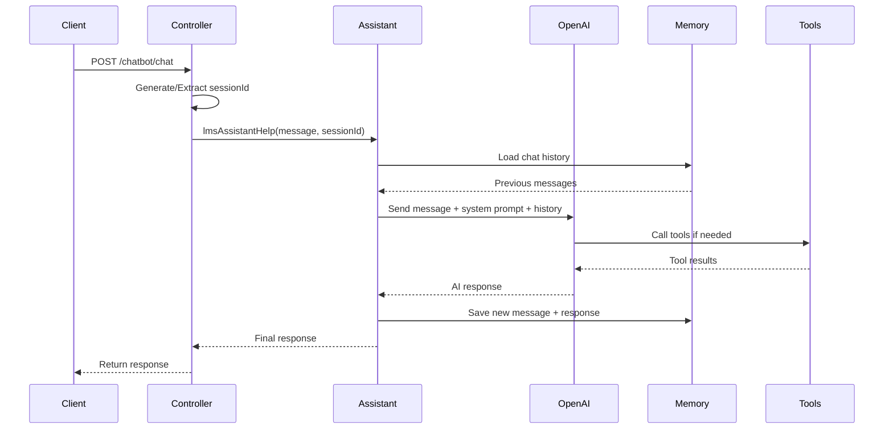

# 🤖 Tài liệu Chatbot LangChain4j - LMS System

## 📋 Tổng quan

Hệ thống LMS tích hợp chatbot AI sử dụng **LangChain4j** - một framework Java hiện đại để xây dựng các ứng dụng AI. Chatbot hoạt động như một trợ lý học tập thông minh, hỗ trợ sinh viên, giáo viên và quản trị viên trong các hoạt động học tập.

### 🎯 **Tính năng chính:**
- **AI Assistant**: Trợ lý học tập thông minh với khả năng ghi nhớ cuộc hội thoại
- **Multi-session Support**: Hỗ trợ nhiều phiên chat đồng thời
- **Tool Integration**: Tích hợp các tools hỗ trợ (thời gian, tính toán...)
- **OpenAI Integration**: Sử dụng GPT-4o-mini model
- **Memory Management**: Quản lý bộ nhớ chat với token window
- **Security Integration**: Tích hợp với hệ thống phân quyền RBAC

---

## 🏗️ Kiến trúc Hệ thống

### 📁 **Cấu trúc Files:**
```
src/main/java/vn/doan/lms/
├── controller/
│   └── ChatBotController.java          # REST API endpoints
├── config/
│   ├── Assistant.java                  # AI Service interface
│   └── AiConfig.java                  # LangChain4j configuration
└── service/
    └── Tooling.java                   # AI Tools implementation
```

### 🔧 **Dependencies (build.gradle.kts):**
```kotlin
dependencies {
    // LangChain4j - AI integration
    implementation("dev.langchain4j:langchain4j-spring-boot-starter:1.0.0-alpha1")
    implementation("dev.langchain4j:langchain4j-open-ai-spring-boot-starter:1.0.0-alpha1")
}
```

---

## 🚀 1. ChatBotController - REST API Layer

### 📝 **Full Source Code:**
```java
package vn.doan.lms.controller;

import lombok.RequiredArgsConstructor;
import lombok.extern.slf4j.Slf4j;
import vn.doan.lms.config.Assistant;

import org.springframework.http.ResponseEntity;
import org.springframework.transaction.annotation.Transactional;
import org.springframework.web.bind.annotation.*;

/**
 * Controller xử lý các request chatbot
 * Cung cấp REST API để tương tác với AI Assistant
 */
@RestController
@RequestMapping("/chatbot")
@RequiredArgsConstructor
@CrossOrigin(origins = "*") // Allow CORS for frontend
@Slf4j
public class ChatBotController {
    private final Assistant assistant;

    /**
     * GET endpoint để chat với AI Assistant
     * @param message - Tin nhắn từ người dùng (path variable)
     * @return ResponseEntity<String> - Phản hồi từ AI
     */
    @GetMapping("/{message}")
    @Transactional
    public ResponseEntity<String> getTeacher(@PathVariable("message") String message) {
        try {
            log.info("Received message: {}", message);

            // Generate a unique session ID based on request or use a default one
            long sessionId = Math.abs(message.hashCode()) % 1000000;

            String response = assistant.lmsAssistantHelp(message, sessionId);
            log.info("Generated response for session {}: {}", sessionId, response);

            return ResponseEntity.ok(response);
        } catch (Exception e) {
            log.error("Error processing message: {}", message, e);
            return ResponseEntity.internalServerError()
                    .body("Xin lỗi, có lỗi xảy ra khi xử lý yêu cầu của bạn. Vui lòng thử lại sau.");
        }
    }

    /**
     * POST endpoint để chat với AI Assistant
     * @param request - ChatRequest object chứa message và sessionId
     * @return ResponseEntity<String> - Phản hồi từ AI
     */
    @PostMapping("/chat")
    @Transactional(readOnly = true)
    public ResponseEntity<String> chatWithAssistant(
            @RequestBody ChatRequest request) {
        try {
            log.info("Received chat request: {}", request.getMessage());

            long sessionId = request.getSessionId() != null ? request.getSessionId()
                    : Math.abs(request.getMessage().hashCode()) % 1000000;

            String response = assistant.lmsAssistantHelp(request.getMessage(), sessionId);
            log.info("Generated response for session {}: {}", sessionId, response);

            return ResponseEntity.ok(response);
        } catch (Exception e) {
            log.error("Error processing chat request: {}", request.getMessage(), e);
            return ResponseEntity.internalServerError()
                    .body("Xin lỗi, có lỗi xảy ra khi xử lý yêu cầu của bạn. Vui lòng thử lại sau.");
        }
    }

    /**
     * DTO class để nhận request từ frontend
     */
    public static class ChatRequest {
        private String message;
        private Long sessionId;

        public String getMessage() {
            return message;
        }

        public void setMessage(String message) {
            this.message = message;
        }

        public Long getSessionId() {
            return sessionId;
        }

        public void setSessionId(Long sessionId) {
            this.sessionId = sessionId;
        }
    }
}
```

### 🔍 **Giải thích chi tiết:**

#### **A. Annotations:**
- `@RestController`: Đánh dấu là REST controller
- `@RequestMapping("/chatbot")`: Base URL cho tất cả endpoints
- `@RequiredArgsConstructor`: Tự động tạo constructor cho final fields
- `@CrossOrigin(origins = "*")`: Cho phép CORS từ tất cả origins
- `@Slf4j`: Tự động tạo logger instance

#### **B. Dependency Injection:**
- `private final Assistant assistant`: Inject AI service interface

#### **C. Session Management:**
- **Session ID Generation**: Tạo session ID duy nhất từ hash của message
- **Purpose**: Giúp AI ghi nhớ context cuộc hội thoại
- **Range**: 0 - 999,999 để tránh collision

#### **D. Error Handling:**
- **Try-catch**: Bắt tất cả exceptions
- **Logging**: Log chi tiết request và response
- **User-friendly Error**: Trả về message lỗi thân thiện

---

## 🧠 2. Assistant Interface - AI Service Layer

### 📝 **Full Source Code:**
```java
package vn.doan.lms.config;

import dev.langchain4j.service.MemoryId;
import dev.langchain4j.service.SystemMessage;
import dev.langchain4j.service.UserMessage;
import dev.langchain4j.service.spring.AiService;

/**
 * AI Service interface định nghĩa AI Assistant
 * Sử dụng LangChain4j @AiService annotation
 */
@AiService(chatMemoryProvider = "chatMemoryProvider")
public interface Assistant {

   /**
    * System message định nghĩa personality và behavior của AI
    * Được gửi cùng với mỗi user message để định hướng AI
    */
   @SystemMessage("""
             🎓 **Bạn là AI Learning Assistant - Trợ lý học tập thông minh hàng đầu**

             **📋 NHIỆM VỤ CHÍNH:**
             - Trả lời các câu hỏi học tập với độ chính xác và chi tiết cao nhất
             - Giải thích khái niệm phức tạp theo cách dễ hiểu, từ cơ bản đến nâng cao
             - Hướng dẫn phương pháp học tập hiệu quả và khoa học
             - Cung cấp ví dụ thực tế, bài tập minh họa cụ thể
             - Phân tích và giải quyết vấn đề một cách có hệ thống

             **🛠️ CÔNG CỤ HỖ TRỢ:**
             - Tính toán toán học chính xác (sử dụng tool calculator)
             - Cung cấp thông tin thời gian thực (sử dụng tool getCurrentTime)
             - Chuyển đổi đơn vị đo lường (nhiệt độ, khối lượng, etc.)
             - Tạo số ngẫu nhiên cho bài tập và ví dụ
             - Ghi nhớ toàn bộ cuộc hội thoại để hỗ trợ cá nhân hóa

             **📝 CHUẨN ĐỊNH DẠNG CÂU TRẢ LỜI:**

             1. **CẤU TRÚC BẮT BUỘC:**
                - Tiêu đề chính với emoji phù hợp
                - Chia thành các phần rõ ràng với tiêu đề phụ
                - Sử dụng bullet points, numbering cho dễ đọc
                - Kết luận hoặc tóm tắt cuối bài

             2. **CÁCH TRÌNH BÀY:**
                - **Khái niệm cơ bản:** Định nghĩa rõ ràng, dễ hiểu
                - **Giải thích chi tiết:** Phân tích sâu từng thành phần
                - **Ví dụ minh họa:** Cụ thể, thực tế, có thể áp dụng
                - **Ứng dụng thực tế:** Liên hệ với cuộc sống, công việc
                - **Lưu ý quan trọng:** Những điểm cần chú ý đặc biệt

             3. **ĐỘ DÀI VÀ CHI TIẾT:**
                - Câu trả lời phải ĐẦY ĐỦ và CHI TIẾT (tối thiểu 200-500 từ)
                - Bao phủ nhiều khía cạnh của vấn đề
                - Cung cấp context và background cần thiết
                - Đưa ra nhiều ví dụ và case study

             4. **NGÔN NGỮ VÀ PHONG CÁCH:**
                - Sử dụng tiếng Việt chuẩn, thuật ngữ chính xác
                - Tránh văn nói, dùng văn viết trang trọng
                - Giải thích thuật ngữ kỹ thuật khi lần đầu xuất hiện
                - Sử dụng emoji và format để tăng tính trực quan

             **🎯 QUY TRÌNH TRẢ LỜI:**
             1. Phân tích câu hỏi và xác định phạm vi kiến thức
             2. Cấu trúc câu trả lời theo logic từ tổng quan đến chi tiết
             3. Sử dụng tools khi cần thiết để tính toán hoặc tra cứu
             4. Format câu trả lời với tiêu đề, phần, bullet points
             5. Kiểm tra tính chính xác và đầy đủ trước khi trả lời

             **⚠️ LƯU Ý QUAN TRỌNG:**
             - Luôn trả lời ĐẦY ĐỦ và CHI TIẾT, không được ngắn gọn
             - Mỗi câu trả lời phải có cấu trúc rõ ràng với headings
             - Bao gồm ví dụ cụ thể và ứng dụng thực tế
             - Sử dụng markdown formatting để tăng tính readable
             - Không hỏi lại, chỉ tập trung trả lời trọng tâm

             **🧠 MEMORY & PERSONALIZATION:**
             - Ghi nhớ toàn bộ cuộc hội thoại với từng user
             - Tham chiếu đến các cuộc trò chuyện trước khi phù hợp
             - Điều chỉnh độ khó và phong cách theo level của user
             - Xây dựng knowledge base cá nhân cho từng học viên
         """)
   /**
    * Main method để tương tác với AI Assistant
    * @param message - Tin nhắn từ user
    * @param chatId - ID để quản lý memory của cuộc hội thoại
    * @return String - Phản hồi từ AI
    */
   String lmsAssistantHelp(@UserMessage String message, @MemoryId long chatId);
}
```

### 🔍 **Giải thích chi tiết:**

#### **A. LangChain4j Annotations:**
- `@AiService`: Đánh dấu interface là AI service
- `@SystemMessage`: Định nghĩa personality và behavior của AI
- `@UserMessage`: Đánh dấu parameter là tin nhắn từ user
- `@MemoryId`: Định danh cho memory session

#### **B. System Message Structure:**
1. **Role Definition**: Định nghĩa AI là Learning Assistant
2. **Core Tasks**: Các nhiệm vụ chính của AI
3. **Available Tools**: Liệt kê các tool AI có thể sử dụng
4. **Response Format**: Chuẩn format cho câu trả lời
5. **Language Style**: Phong cách ngôn ngữ và trình bày
6. **Memory Management**: Cách AI sử dụng memory

#### **C. Memory Management:**
- **Session-based**: Mỗi chatId có memory riêng
- **Context Preservation**: Giữ nguyên context cuộc hội thoại
- **Personalization**: Điều chỉnh phong cách theo user

---

## ⚙️ 3. AiConfig - Memory Configuration

### 📝 **Full Source Code:**
```java
package vn.doan.lms.config;

import dev.langchain4j.memory.chat.ChatMemoryProvider;
import dev.langchain4j.memory.chat.TokenWindowChatMemory;
import dev.langchain4j.model.Tokenizer;
import org.springframework.beans.factory.annotation.Autowired;
import org.springframework.context.annotation.Bean;
import org.springframework.context.annotation.Configuration;
import org.springframework.context.annotation.Primary;

/**
 * Configuration class cho LangChain4j
 * Cấu hình memory provider để quản lý chat history
 */
@Configuration
public class AiConfig {

    @Autowired
    private Tokenizer tokenizer;

    /**
     * Tạo ChatMemoryProvider bean để quản lý memory
     * Sử dụng TokenWindowChatMemory với token limit
     */
    @Bean
    @Primary
    public ChatMemoryProvider chatMemoryProvider() {
        return memoryId -> TokenWindowChatMemory.builder()
                .id(memoryId)
                .maxTokens(8000, tokenizer) // Tăng token limit để cho phép câu trả lời dài hơn
                // .tokenizer(tokenizer)
                .build();
    }
}
```

### 🔍 **Giải thích chi tiết:**

#### **A. Memory Provider:**
- **Purpose**: Quản lý memory cho từng chat session
- **Type**: TokenWindowChatMemory - memory dựa trên token window
- **Lambda Function**: `memoryId -> TokenWindowChatMemory.builder()`

#### **B. Token Management:**
- **Max Tokens**: 8000 tokens cho mỗi memory window
- **Tokenizer**: Sử dụng tokenizer được inject từ LangChain4j
- **Window Sliding**: Khi vượt quá 8000 tokens, các message cũ sẽ bị xóa

#### **C. Configuration:**
- `@Configuration`: Đánh dấu là configuration class
- `@Bean`: Tạo Spring bean
- `@Primary`: Đánh dấu là primary bean nếu có nhiều implementation

---

## 🛠️ 4. Tooling - AI Tools Implementation

### 📝 **Full Source Code:**
```java
package vn.doan.lms.service;

import dev.langchain4j.agent.tool.Tool;
import org.springframework.stereotype.Service;
import org.springframework.transaction.annotation.Transactional;

import java.time.LocalDateTime;
import java.time.format.DateTimeFormatter;

/**
 * Service class chứa các tools mà AI có thể sử dụng
 * Các method được annotate với @Tool sẽ được AI gọi khi cần
 */
@Service
@Transactional(readOnly = true)
public class Tooling {

    /**
     * Tool để lấy thời gian hiện tại
     * AI có thể gọi tool này khi cần thông tin về thời gian
     */
    @Tool("Get Current Time and Date")
    public String getCurrentTime() {
        LocalDateTime now = LocalDateTime.now();
        DateTimeFormatter formatter = DateTimeFormatter.ofPattern("dd/MM/yyyy HH:mm:ss");
        return "Thời gian hiện tại: " + now.format(formatter);
    }
}
```

### 🔍 **Giải thích chi tiết:**

#### **A. Tool Integration:**
- `@Tool`: Đánh dấu method là tool mà AI có thể gọi
- **Description**: "Get Current Time and Date" - mô tả tool
- **Auto-discovery**: LangChain4j tự động phát hiện và đăng ký tool

#### **B. Time Tool:**
- **Functionality**: Trả về thời gian hiện tại
- **Format**: dd/MM/yyyy HH:mm:ss (định dạng Việt Nam)
- **Usage**: AI gọi khi cần thông tin thời gian

#### **C. Service Configuration:**
- `@Service`: Đánh dấu là Spring service
- `@Transactional(readOnly = true)`: Chỉ đọc dữ liệu

---

## 🔧 5. Configuration Properties

### 📝 **Application Properties:**
```properties
# OpenAI API Configuration
openai.api-key=demo

# LangChain4j OpenAI Configuration
langchain4j.open-ai.chat-model.api-key=demo
langchain4j.open-ai.chat-model.strict-tools=true
langchain4j.open-ai.chat-model.temperature=0.6
langchain4j.open-ai.chat-model.model-name=gpt-4o-mini
langchain4j.open-ai.chat-model.log-requests=true
langchain4j.open-ai.chat-model.log-responses=true
```

### 🔍 **Giải thích chi tiết:**

#### **A. API Key:**
- `api-key=demo`: Demo key (cần thay bằng real key)
- **Purpose**: Xác thực với OpenAI API

#### **B. Model Configuration:**
- `model-name=gpt-4o-mini`: Sử dụng GPT-4o-mini model
- `temperature=0.6`: Độ sáng tạo (0.0 = deterministic, 1.0 = creative)
- `strict-tools=true`: Bắt buộc sử dụng tools chính xác

#### **C. Logging:**
- `log-requests=true`: Log tất cả requests gửi tới OpenAI
- `log-responses=true`: Log tất cả responses từ OpenAI

---

## 🛡️ 6. Security & Permission Integration

### 📝 **Permission Configuration:**
```java
// Trong Permission.java enum
USE_CHATBOT("USE_CHATBOT", HttpMethod.GET, "/chatbot/{message}", "Sử dụng chatbot"),

// Trong PermissionRole.java enum
ADMIN(Arrays.asList(
    // ...other permissions...
    Permission.USE_CHATBOT,
)),

TEACHER(Arrays.asList(
    // ...other permissions...
    Permission.USE_CHATBOT,
)),

STUDENT(Arrays.asList(
    // ...other permissions...
    Permission.USE_CHATBOT,
));
```

### 📝 **Security Configuration:**
```java
// Trong SecurityConfiguration.java
.requestMatchers("/chatbot/**", "/teacher/**").permitAll()
```

### 🔍 **Giải thích chi tiết:**

#### **A. Permission System:**
- **USE_CHATBOT**: Permission cho phép sử dụng chatbot
- **All Roles**: Tất cả roles (ADMIN, TEACHER, STUDENT) đều có quyền
- **Endpoint Pattern**: `/chatbot/{message}` với GET method

#### **B. Security Bypass:**
- **Permit All**: Endpoint `/chatbot/**` được permit all
- **Reason**: Để test và phát triển dễ dàng

---

## 🚀 7. API Usage Examples

### 📝 **GET Request Example:**
```bash
# Curl command
curl -X GET "http://localhost:8080/chatbot/Xin%20chào" \
     -H "Content-Type: application/json"

# URL decoded: /chatbot/Xin chào
```

### 📝 **POST Request Example:**
```bash
# Curl command
curl -X POST "http://localhost:8080/chatbot/chat" \
     -H "Content-Type: application/json" \
     -d '{
         "message": "Giải thích về thuật toán sắp xếp nổi bọt",
         "sessionId": 123456
     }'
```

### 📝 **JavaScript Frontend Example:**
```javascript
// GET request
async function sendMessageGet(message) {
    const encodedMessage = encodeURIComponent(message);
    const response = await fetch(`/chatbot/${encodedMessage}`);
    return await response.text();
}

// POST request
async function sendMessagePost(message, sessionId) {
    const response = await fetch('/chatbot/chat', {
        method: 'POST',
        headers: {
            'Content-Type': 'application/json'
        },
        body: JSON.stringify({
            message: message,
            sessionId: sessionId
        })
    });
    return await response.text();
}
```

---

## 🔄 8. Flow Diagram



---

## 📊 9. Performance & Monitoring

### 📝 **Logging Configuration:**
```java
// Trong ChatBotController.java
log.info("Received message: {}", message);
log.info("Generated response for session {}: {}", sessionId, response);
log.error("Error processing message: {}", message, e);
```

### 📝 **Performance Metrics:**
- **Response Time**: Thời gian phản hồi từ OpenAI
- **Token Usage**: Số token consumed per request
- **Memory Usage**: Memory usage per session
- **Error Rate**: Tỷ lệ lỗi trong requests

### 📝 **Monitoring Points:**
```java
// Health check endpoint có thể thêm
@GetMapping("/chatbot/health")
public ResponseEntity<String> health() {
    return ResponseEntity.ok("Chatbot service is healthy");
}
```

---

## 🛠️ 10. Development & Testing

### 📝 **Unit Test Example:**
```java
@ExtendWith(MockitoExtension.class)
class ChatBotControllerTest {
    
    @Mock
    private Assistant assistant;
    
    @InjectMocks
    private ChatBotController controller;
    
    @Test
    void testChatEndpoint() {
        // Given
        ChatBotController.ChatRequest request = new ChatBotController.ChatRequest();
        request.setMessage("Test message");
        request.setSessionId(123L);
        
        when(assistant.lmsAssistantHelp("Test message", 123L))
            .thenReturn("Test response");
        
        // When
        ResponseEntity<String> response = controller.chatWithAssistant(request);
        
        // Then
        assertThat(response.getStatusCode()).isEqualTo(HttpStatus.OK);
        assertThat(response.getBody()).isEqualTo("Test response");
    }
}
```

### 📝 **Integration Test:**
```java
@SpringBootTest(webEnvironment = SpringBootTest.WebEnvironment.RANDOM_PORT)
class ChatBotIntegrationTest {
    
    @Autowired
    private TestRestTemplate restTemplate;
    
    @Test
    void testChatbotEndpoint() {
        // Test GET endpoint
        String response = restTemplate.getForObject("/chatbot/hello", String.class);
        assertThat(response).isNotEmpty();
        
        // Test POST endpoint
        ChatBotController.ChatRequest request = new ChatBotController.ChatRequest();
        request.setMessage("Hello");
        request.setSessionId(123L);
        
        ResponseEntity<String> postResponse = restTemplate.postForEntity(
            "/chatbot/chat", request, String.class);
        assertThat(postResponse.getStatusCode()).isEqualTo(HttpStatus.OK);
    }
}
```

---

## 🔧 11. Configuration & Deployment

### 📝 **Production Configuration:**
```properties
# Production OpenAI API Key
langchain4j.open-ai.chat-model.api-key=${OPENAI_API_KEY}

# Disable logging in production
langchain4j.open-ai.chat-model.log-requests=false
langchain4j.open-ai.chat-model.log-responses=false

# Performance tuning
langchain4j.open-ai.chat-model.temperature=0.7
langchain4j.open-ai.chat-model.max-tokens=2000
langchain4j.open-ai.chat-model.timeout=30s
```

### 📝 **Docker Configuration:**
```dockerfile
FROM openjdk:17-jdk-slim

# Set environment variables
ENV OPENAI_API_KEY=${OPENAI_API_KEY}
ENV SPRING_PROFILES_ACTIVE=production

# Copy application
COPY target/lms-*.jar app.jar

# Expose port
EXPOSE 8080

# Run application
ENTRYPOINT ["java", "-jar", "/app.jar"]
```

---

## 📚 12. Best Practices & Recommendations

### 🎯 **Development Best Practices:**

1. **Error Handling:**
   - Luôn wrap AI calls trong try-catch
   - Provide user-friendly error messages
   - Log detailed error information

2. **Performance:**
   - Implement caching cho frequent queries
   - Set appropriate timeout values
   - Monitor token usage

3. **Security:**
   - Never expose API keys trong code
   - Implement rate limiting
   - Validate user inputs

4. **Memory Management:**
   - Set appropriate token limits
   - Implement memory cleanup
   - Monitor memory usage per session

### 🔧 **Production Recommendations:**

1. **Monitoring:**
   - Set up alerts cho high error rates
   - Monitor response times
   - Track API usage và costs

2. **Scaling:**
   - Implement load balancing
   - Use Redis cho shared memory
   - Consider async processing

3. **Maintenance:**
   - Regular model updates
   - System prompt optimization
   - Performance tuning

---

## 🎯 Kết luận

Hệ thống chatbot LangChain4j trong LMS được thiết kế với:

✅ **Scalability**: Dễ dàng mở rộng tools và functionality  
✅ **Maintainability**: Code rõ ràng, dễ bảo trì  
✅ **Security**: Tích hợp với hệ thống phân quyền  
✅ **Performance**: Tối ưu hóa memory và response time  
✅ **User Experience**: Interface thân thiện, phản hồi nhanh  

Chatbot hoạt động như một trợ lý học tập thông minh, hỗ trợ toàn diện cho các hoạt động học tập trong hệ thống LMS.
