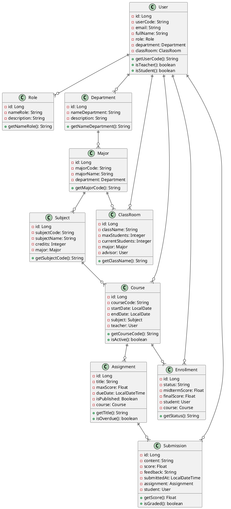
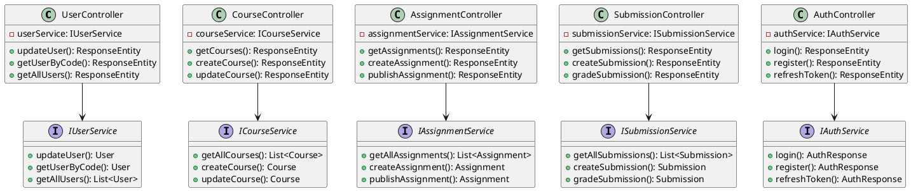
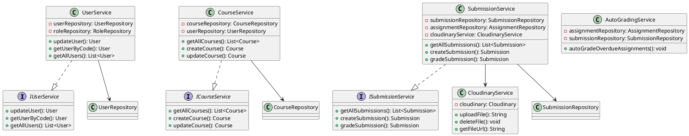
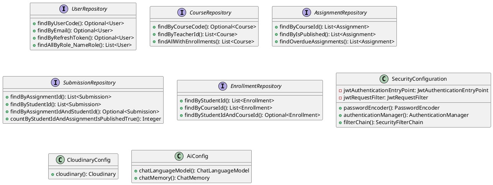

# Simple Class Diagram - LMS

## Entity Classes Only

```plantuml
@startuml LMS_Entities
class User {
  -id: Long
  -userCode: String
  -email: String
  -fullName: String
  -role: Role
  -department: Department
  -classRoom: ClassRoom
  +getUserCode(): String
  +isTeacher(): boolean
  +isStudent(): boolean
}

class Role {
  -id: Long
  -nameRole: String
  -description: String
  +getNameRole(): String
}

class Department {
  -id: Long
  -nameDepartment: String
  -description: String
  +getNameDepartment(): String
}

class Major {
  -id: Long
  -majorCode: String
  -majorName: String
  -department: Department
  +getMajorCode(): String
}

class ClassRoom {
  -id: Long
  -className: String
  -maxStudents: Integer
  -currentStudents: Integer
  -major: Major
  -advisor: User
  +getClassName(): String
}

class Subject {
  -id: Long
  -subjectCode: String
  -subjectName: String
  -credits: Integer
  -major: Major
  +getSubjectCode(): String
}

class Course {
  -id: Long
  -courseCode: String
  -startDate: LocalDate
  -endDate: LocalDate
  -subject: Subject
  -teacher: User
  +getCourseCode(): String
  +isActive(): boolean
}

class Enrollment {
  -id: Long
  -status: String
  -midtermScore: Float
  -finalScore: Float
  -student: User
  -course: Course
  +getStatus(): String
}

class Assignment {
  -id: Long
  -title: String
  -maxScore: Float
  -dueDate: LocalDateTime
  -isPublished: Boolean
  -course: Course
  +getTitle(): String
  +isOverdue(): boolean
}

class Submission {
  -id: Long
  -content: String
  -score: Float
  -feedback: String
  -submittedAt: LocalDateTime
  -assignment: Assignment
  -student: User
  +getScore(): Float
  +isGraded(): boolean
}

User ||--o{ Role
User ||--o{ Department
User ||--o{ ClassRoom
Department ||--o{ Major
Major ||--o{ ClassRoom
Major ||--o{ Subject
Subject ||--o{ Course
User ||--o{ Course
Course ||--o{ Enrollment
User ||--o{ Enrollment
Course ||--o{ Assignment
Assignment ||--o{ Submission
User ||--o{ Submission

@enduml
```

## Controller Classes

```plantuml
@startuml LMS_Controllers
class UserController {
  -userService: IUserService
  +updateUser(): ResponseEntity
  +getUserByCode(): ResponseEntity
  +getAllUsers(): ResponseEntity
}

class CourseController {
  -courseService: ICourseService
  +getCourses(): ResponseEntity
  +createCourse(): ResponseEntity
  +updateCourse(): ResponseEntity
}

class AssignmentController {
  -assignmentService: IAssignmentService
  +getAssignments(): ResponseEntity
  +createAssignment(): ResponseEntity
  +publishAssignment(): ResponseEntity
}

class SubmissionController {
  -submissionService: ISubmissionService
  +getSubmissions(): ResponseEntity
  +createSubmission(): ResponseEntity
  +gradeSubmission(): ResponseEntity
}

class AuthController {
  -authService: IAuthService
  +login(): ResponseEntity
  +register(): ResponseEntity
  +refreshToken(): ResponseEntity
}

interface IUserService {
  +updateUser(): User
  +getUserByCode(): User
  +getAllUsers(): List<User>
}

interface ICourseService {
  +getAllCourses(): List<Course>
  +createCourse(): Course
  +updateCourse(): Course
}

interface IAssignmentService {
  +getAllAssignments(): List<Assignment>
  +createAssignment(): Assignment
  +publishAssignment(): Assignment
}

interface ISubmissionService {
  +getAllSubmissions(): List<Submission>
  +createSubmission(): Submission
  +gradeSubmission(): Submission
}

interface IAuthService {
  +login(): AuthResponse
  +register(): AuthResponse
  +refreshToken(): AuthResponse
}

UserController --> IUserService
CourseController --> ICourseService
AssignmentController --> IAssignmentService
SubmissionController --> ISubmissionService
AuthController --> IAuthService

@enduml
```

## Service Implementation Classes

```plantuml
@startuml LMS_Services
interface IUserService {
  +updateUser(): User
  +getUserByCode(): User
  +getAllUsers(): List<User>
}

interface ICourseService {
  +getAllCourses(): List<Course>
  +createCourse(): Course
  +updateCourse(): Course
}

interface ISubmissionService {
  +getAllSubmissions(): List<Submission>
  +createSubmission(): Submission
  +gradeSubmission(): Submission
}

class UserService {
  -userRepository: UserRepository
  -roleRepository: RoleRepository
  +updateUser(): User
  +getUserByCode(): User
  +getAllUsers(): List<User>
}

class CourseService {
  -courseRepository: CourseRepository
  -userRepository: UserRepository
  +getAllCourses(): List<Course>
  +createCourse(): Course
  +updateCourse(): Course
}

class SubmissionService {
  -submissionRepository: SubmissionRepository
  -assignmentRepository: AssignmentRepository
  -cloudinaryService: CloudinaryService
  +getAllSubmissions(): List<Submission>
  +createSubmission(): Submission
  +gradeSubmission(): Submission
}

class CloudinaryService {
  -cloudinary: Cloudinary
  +uploadFile(): String
  +deleteFile(): void
  +getFileUrl(): String
}

class AutoGradingService {
  -assignmentRepository: AssignmentRepository
  -submissionRepository: SubmissionRepository
  +autoGradeOverdueAssignments(): void
}

UserService ..|> IUserService
CourseService ..|> ICourseService
SubmissionService ..|> ISubmissionService

UserService --> UserRepository
CourseService --> CourseRepository
SubmissionService --> SubmissionRepository
SubmissionService --> CloudinaryService

@enduml
```

## Repository Classes

```plantuml
@startuml LMS_Repositories
interface UserRepository {
  +findByUserCode(): Optional<User>
  +findByEmail(): Optional<User>
  +findByRefreshToken(): Optional<User>
  +findAllByRole_NameRole(): List<User>
}

interface CourseRepository {
  +findByCourseCode(): Optional<Course>
  +findByTeacherId(): List<Course>
  +findAllWithEnrollments(): List<Course>
}

interface AssignmentRepository {
  +findByCourseId(): List<Assignment>
  +findByIsPublished(): List<Assignment>
  +findOverdueAssignments(): List<Assignment>
}

interface SubmissionRepository {
  +findByAssignmentId(): List<Submission>
  +findByStudentId(): List<Submission>
  +findByAssignmentIdAndStudentId(): Optional<Submission>
  +countByStudentIdAndAssignmentIsPublishedTrue(): Integer
}

interface EnrollmentRepository {
  +findByStudentId(): List<Enrollment>
  +findByCourseId(): List<Enrollment>
  +findByStudentIdAndCourseId(): Optional<Enrollment>
}

class SecurityConfiguration {
  -jwtAuthenticationEntryPoint: JwtAuthenticationEntryPoint
  -jwtRequestFilter: JwtRequestFilter
  +passwordEncoder(): PasswordEncoder
  +authenticationManager(): AuthenticationManager
  +filterChain(): SecurityFilterChain
}

class CloudinaryConfig {
  +cloudinary(): Cloudinary
}

class AiConfig {
  +chatLanguageModel(): ChatLanguageModel
  +chatMemory(): ChatMemory
}

@enduml
```
