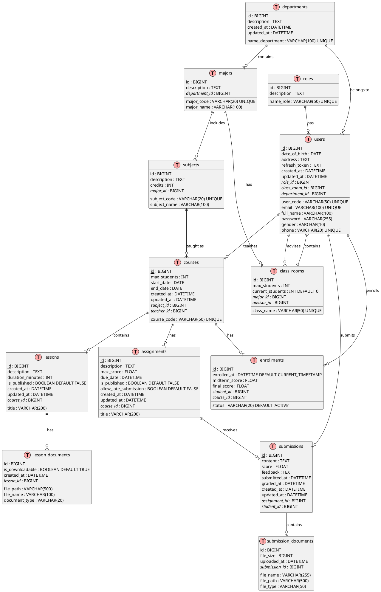
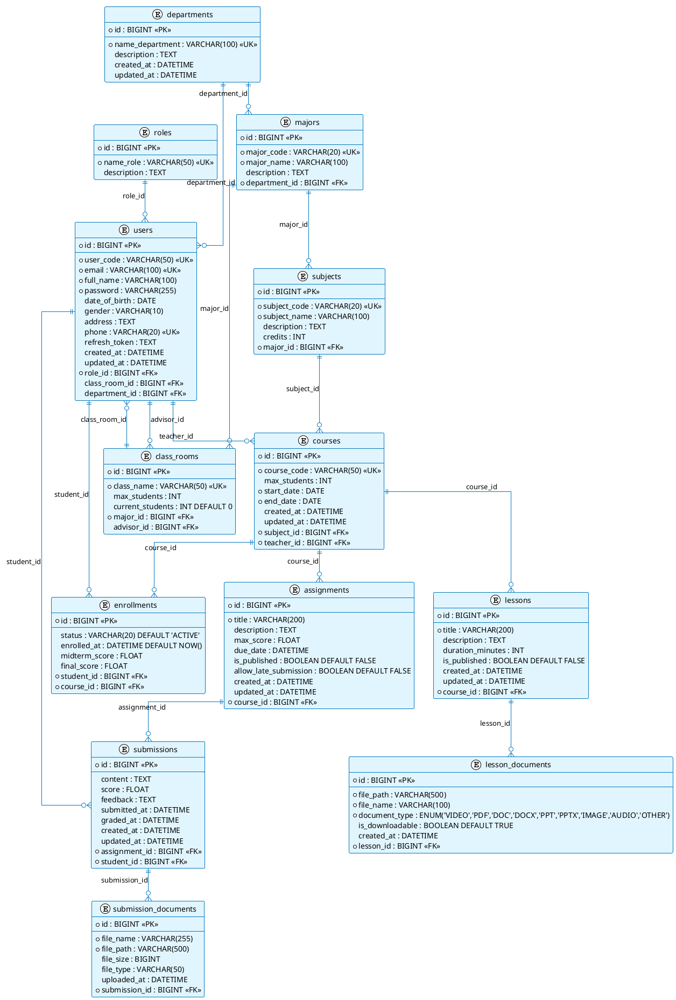

# ERD Diagram - Learning Management System (LMS)

## Entity Relationship Diagram



## Mô tả các Entity chính:

### 1. **Quản lý người dùng (User Management)**
- **users**: Lưu thông tin tất cả người dùng (Admin, Teacher, Student)
- **roles**: Định nghĩa vai trò (Admin, Teacher, Student)
- **departments**: Khoa/Phòng ban
- **majors**: Chuyên ngành
- **class_rooms**: Lớp học

### 2. **Quản lý môn học và khóa học (Academic Management)**
- **subjects**: Môn học
- **courses**: Khóa học cụ thể của môn học
- **enrollments**: Đăng ký học của sinh viên

### 3. **Quản lý bài học (Lesson Management)**
- **lessons**: Bài học trong khóa học
- **lesson_documents**: Tài liệu bài học

### 4. **Quản lý bài tập (Assignment Management)**
- **assignments**: Bài tập/đồ án
- **submissions**: Bài nộp của sinh viên
- **submission_documents**: File đính kèm bài nộp

## Quan hệ chính:

1. **User - Role**: Many-to-One (Một user có một role)
2. **User - Department**: Many-to-One (Nhiều user thuộc một department)
3. **Department - Major**: One-to-Many (Một department có nhiều major)
4. **Major - Subject**: One-to-Many (Một major có nhiều subject)
5. **Subject - Course**: One-to-Many (Một subject có nhiều course)
6. **User (Teacher) - Course**: One-to-Many (Một teacher dạy nhiều course)
7. **Student - Course**: Many-to-Many thông qua Enrollment
8. **Course - Lesson**: One-to-Many
9. **Course - Assignment**: One-to-Many
10. **Assignment - Submission**: One-to-Many
11. **Student - Submission**: One-to-Many

## Đặc điểm thiết kế:

- **Điểm số**: Lưu trong bảng `enrollments` (midterm_score, final_score)
- **File storage**: Sử dụng Cloudinary (lưu đường dẫn trong database)
- **Soft delete**: Có thể áp dụng cho các entity quan trọng
- **Audit fields**: created_at, updated_at cho tracking thay đổi
- **Status tracking**: enrollment status, assignment publication status

# Database Schema Diagram



## Physical Database Design

### **Indexes Recommendations:**

```sql
-- Primary Keys (auto-created)
-- Unique constraints (auto-created)

-- Performance Indexes
CREATE INDEX idx_users_role_id ON users(role_id);
CREATE INDEX idx_users_department_id ON users(department_id);
CREATE INDEX idx_users_class_room_id ON users(class_room_id);
CREATE INDEX idx_enrollments_student_course ON enrollments(student_id, course_id);
CREATE INDEX idx_submissions_assignment_student ON submissions(assignment_id, student_id);
CREATE INDEX idx_courses_teacher_id ON courses(teacher_id);
CREATE INDEX idx_courses_subject_id ON courses(subject_id);
CREATE INDEX idx_assignments_course_id ON assignments(course_id);
CREATE INDEX idx_lessons_course_id ON lessons(course_id);

-- Search Indexes
CREATE INDEX idx_users_email ON users(email);
CREATE INDEX idx_users_user_code ON users(user_code);
CREATE INDEX idx_courses_course_code ON courses(course_code);
CREATE INDEX idx_subjects_subject_code ON subjects(subject_code);
```

### **Constraints:**

```sql
-- Foreign Key Constraints
ALTER TABLE users ADD CONSTRAINT fk_users_role FOREIGN KEY (role_id) REFERENCES roles(id);
ALTER TABLE users ADD CONSTRAINT fk_users_department FOREIGN KEY (department_id) REFERENCES departments(id);
ALTER TABLE users ADD CONSTRAINT fk_users_class_room FOREIGN KEY (class_room_id) REFERENCES class_rooms(id);
ALTER TABLE majors ADD CONSTRAINT fk_majors_department FOREIGN KEY (department_id) REFERENCES departments(id);
ALTER TABLE class_rooms ADD CONSTRAINT fk_class_rooms_major FOREIGN KEY (major_id) REFERENCES majors(id);
ALTER TABLE class_rooms ADD CONSTRAINT fk_class_rooms_advisor FOREIGN KEY (advisor_id) REFERENCES users(id);
ALTER TABLE subjects ADD CONSTRAINT fk_subjects_major FOREIGN KEY (major_id) REFERENCES majors(id);
ALTER TABLE courses ADD CONSTRAINT fk_courses_subject FOREIGN KEY (subject_id) REFERENCES subjects(id);
ALTER TABLE courses ADD CONSTRAINT fk_courses_teacher FOREIGN KEY (teacher_id) REFERENCES users(id);
ALTER TABLE enrollments ADD CONSTRAINT fk_enrollments_student FOREIGN KEY (student_id) REFERENCES users(id);
ALTER TABLE enrollments ADD CONSTRAINT fk_enrollments_course FOREIGN KEY (course_id) REFERENCES courses(id);
ALTER TABLE lessons ADD CONSTRAINT fk_lessons_course FOREIGN KEY (course_id) REFERENCES courses(id);
ALTER TABLE lesson_documents ADD CONSTRAINT fk_lesson_docs_lesson FOREIGN KEY (lesson_id) REFERENCES lessons(id);
ALTER TABLE assignments ADD CONSTRAINT fk_assignments_course FOREIGN KEY (course_id) REFERENCES courses(id);
ALTER TABLE submissions ADD CONSTRAINT fk_submissions_assignment FOREIGN KEY (assignment_id) REFERENCES assignments(id);
ALTER TABLE submissions ADD CONSTRAINT fk_submissions_student FOREIGN KEY (student_id) REFERENCES users(id);
ALTER TABLE submission_documents ADD CONSTRAINT fk_submission_docs_submission FOREIGN KEY (submission_id) REFERENCES submissions(id);

-- Check Constraints
ALTER TABLE users ADD CONSTRAINT chk_users_gender CHECK (gender IN ('Male', 'Female', 'Other'));
ALTER TABLE enrollments ADD CONSTRAINT chk_enrollments_status CHECK (status IN ('ACTIVE', 'INACTIVE', 'COMPLETED', 'DROPPED'));
ALTER TABLE enrollments ADD CONSTRAINT chk_midterm_score CHECK (midterm_score >= 0 AND midterm_score <= 10);
ALTER TABLE enrollments ADD CONSTRAINT chk_final_score CHECK (final_score >= 0 AND final_score <= 10);
ALTER TABLE assignments ADD CONSTRAINT chk_max_score CHECK (max_score > 0);
ALTER TABLE submissions ADD CONSTRAINT chk_submission_score CHECK (score >= 0);
```

### **Database Storage Considerations:**

1. **File Storage**: Files stored in Cloudinary, only paths in database
2. **Partitioning**: Consider partitioning large tables by date (submissions, enrollments)
3. **Archiving**: Archive old data to maintain performance
4. **Backup Strategy**: Regular backups with point-in-time recovery
5. **Monitoring**: Track query performance and optimize as needed
````markdown
# Class Diagram - Learning Management System (LMS)

```plantuml
@startuml LMS_Class_Diagram
skinparam class {
    BackgroundColor #F0F8FF
    BorderColor #4682B4
    ArrowColor #4682B4
}

package "Entity Models" {
    class User {
        -id: Long
        -userCode: String
        -email: String
        -fullName: String
        -password: String
        -dateOfBirth: LocalDate
        -gender: String
        -address: String
        -phone: String
        -refreshToken: String
        -createdAt: LocalDateTime
        -updatedAt: LocalDateTime
        -role: Role
        -classRoom: ClassRoom
        -department: Department
        +getUserCode(): String
        +getEmail(): String
        +getFullName(): String
        +setPassword(password: String): void
        +isTeacher(): boolean
        +isStudent(): boolean
        +isAdmin(): boolean
    }

    class Role {
        -id: Long
        -nameRole: String
        -description: String
        -users: List<User>
        +getNameRole(): String
        +getDescription(): String
    }

    class Department {
        -id: Long
        -nameDepartment: String
        -description: String
        -createdAt: LocalDateTime
        -updatedAt: LocalDateTime
        -users: List<User>
        -majors: List<Major>
        +getNameDepartment(): String
        +getMajors(): List<Major>
    }

    class Major {
        -id: Long
        -majorCode: String
        -majorName: String
        -description: String
        -department: Department
        -classRooms: List<ClassRoom>
        -subjects: List<Subject>
        +getMajorCode(): String
        +getMajorName(): String
        +getSubjects(): List<Subject>
    }

    class ClassRoom {
        -id: Long
        -className: String
        -maxStudents: Integer
        -currentStudents: Integer
        -major: Major
        -advisor: User
        -students: List<User>
        +getClassName(): String
        +getMaxStudents(): Integer
        +getCurrentStudents(): Integer
        +addStudent(student: User): void
        +removeStudent(student: User): void
    }

    class Subject {
        -id: Long
        -subjectCode: String
        -subjectName: String
        -description: String
        -credits: Integer
        -major: Major
        -courses: List<Course>
        +getSubjectCode(): String
        +getSubjectName(): String
        +getCredits(): Integer
    }

    class Course {
        -id: Long
        -courseCode: String
        -maxStudents: Integer
        -startDate: LocalDate
        -endDate: LocalDate
        -createdAt: LocalDateTime
        -updatedAt: LocalDateTime
        -subject: Subject
        -teacher: User
        -enrollments: List<Enrollment>
        -lessons: List<Lesson>
        -assignments: List<Assignment>
        +getCourseCode(): String
        +getTeacher(): User
        +getEnrollments(): List<Enrollment>
        +addEnrollment(enrollment: Enrollment): void
        +isActive(): boolean
    }

    class Enrollment {
        -id: Long
        -status: String
        -enrolledAt: LocalDateTime
        -midtermScore: Float
        -finalScore: Float
        -student: User
        -course: Course
        +getStatus(): String
        +getMidtermScore(): Float
        +getFinalScore(): Float
        +setMidtermScore(score: Float): void
        +setFinalScore(score: Float): void
        +isActive(): boolean
    }

    class Lesson {
        -id: Long
        -title: String
        -description: String
        -durationMinutes: Integer
        -isPublished: Boolean
        -createdAt: LocalDateTime
        -updatedAt: LocalDateTime
        -course: Course
        -documents: List<LessonDocument>
        +getTitle(): String
        +getDescription(): String
        +getDurationMinutes(): Integer
        +isPublished(): Boolean
        +publish(): void
        +unpublish(): void
    }

    class LessonDocument {
        -id: Long
        -filePath: String
        -fileName: String
        -documentType: String
        -isDownloadable: Boolean
        -createdAt: LocalDateTime
        -lesson: Lesson
        +getFilePath(): String
        +getFileName(): String
        +getDocumentType(): String
        +isDownloadable(): Boolean
    }

    class Assignment {
        -id: Long
        -title: String
        -description: String
        -maxScore: Float
        -dueDate: LocalDateTime
        -isPublished: Boolean
        -allowLateSubmission: Boolean
        -createdAt: LocalDateTime
        -updatedAt: LocalDateTime
        -course: Course
        -submissions: List<Submission>
        +getTitle(): String
        +getDescription(): String
        +getMaxScore(): Float
        +getDueDate(): LocalDateTime
        +isPublished(): Boolean
        +isOverdue(): boolean
        +allowsLateSubmission(): boolean
        +publish(): void
        +unpublish(): void
    }

    class Submission {
        -id: Long
        -content: String
        -score: Float
        -feedback: String
        -submittedAt: LocalDateTime
        -gradedAt: LocalDateTime
        -createdAt: LocalDateTime
        -updatedAt: LocalDateTime
        -assignment: Assignment
        -student: User
        -documents: List<SubmissionDocument>
        +getContent(): String
        +getScore(): Float
        +getFeedback(): String
        +getSubmittedAt(): LocalDateTime
        +isGraded(): boolean
        +isLate(): boolean
        +grade(score: Float, feedback: String): void
    }

    class SubmissionDocument {
        -id: Long
        -fileName: String
        -filePath: String
        -fileSize: Long
        -fileType: String
        -uploadedAt: LocalDateTime
        -submission: Submission
        +getFileName(): String
        +getFilePath(): String
        +getFileSize(): Long
        +getFileType(): String
    }
}

package "Controller" {
    class UserController {
        -userService: IUserService
        +updateUser(): ResponseEntity
        +getUserByCode(): ResponseEntity
        +getAllUsers(): ResponseEntity
    }

    class CourseController {
        -courseService: ICourseService
        +getCourses(): ResponseEntity
        +getCourseById(): ResponseEntity
        +createCourse(): ResponseEntity
        +updateCourse(): ResponseEntity
        +deleteCourse(): ResponseEntity
        +getFullCourseDetails(): ResponseEntity
        +updateStudentScores(): ResponseEntity
    }

    class AssignmentController {
        -assignmentService: IAssignmentService
        +getAssignments(): ResponseEntity
        +getAssignmentById(): ResponseEntity
        +createAssignment(): ResponseEntity
        +updateAssignment(): ResponseEntity
        +deleteAssignment(): ResponseEntity
        +publishAssignment(): ResponseEntity
        +unpublishAssignment(): ResponseEntity
    }

    class SubmissionController {
        -submissionService: ISubmissionService
        +getSubmissions(): ResponseEntity
        +getSubmissionById(): ResponseEntity
        +createSubmission(): ResponseEntity
        +updateSubmission(): ResponseEntity
        +deleteSubmission(): ResponseEntity
        +gradeSubmission(): ResponseEntity
        +getStudentSubmissions(): ResponseEntity
        +getAssignmentSubmissions(): ResponseEntity
        +getSubmittableAssignmentsCount(): ResponseEntity
    }

    class AuthController {
        -authService: IAuthService
        +login(): ResponseEntity
        +register(): ResponseEntity
        +refreshToken(): ResponseEntity
        +logout(): ResponseEntity
    }

    class ChatBotController {
        -chatService: IChatService
        +chat(): ResponseEntity
        +getChatHistory(): ResponseEntity
    }
}

package "Service" {
    interface IUserService {
        +updateUser(): User
        +getUserByCode(): User
        +getAllUsers(): List<User>
        +deleteUser(): void
    }

    interface ICourseService {
        +getAllCourses(): List<Course>
        +getCourseById(): Course
        +createCourse(): Course
        +updateCourse(): Course
        +deleteCourse(): void
        +getFullCourseDetails(): CourseFullDetailsResponse
        +updateStudentScores(): void
    }

    interface IAssignmentService {
        +getAllAssignments(): List<Assignment>
        +getAssignmentById(): Assignment
        +createAssignment(): Assignment
        +updateAssignment(): Assignment
        +deleteAssignment(): void
        +publishAssignment(): Assignment
        +unpublishAssignment(): Assignment
    }

    interface ISubmissionService {
        +getAllSubmissions(): List<Submission>
        +getSubmissionById(): Submission
        +createSubmission(): Submission
        +updateSubmission(): Submission
        +deleteSubmission(): void
        +gradeSubmission(): Submission
        +getStudentSubmissions(): List<Submission>
        +getAssignmentSubmissions(): List<Submission>
        +getSubmittableAssignmentsCount(): Integer
    }

    interface IAuthService {
        +login(): AuthResponse
        +register(): AuthResponse
        +refreshToken(): AuthResponse
        +logout(): void
    }

    interface IChatService {
        +chat(): String
        +getChatHistory(): List<ChatMessage>
    }

    class UserService {
        -userRepository: UserRepository
        -roleRepository: RoleRepository
        -departmentRepository: DepartmentRepository
        -classRoomRepository: ClassRoomRepository
        +updateUser(): User
        +getUserByCode(): User
        +getAllUsers(): List<User>
        +deleteUser(): void
    }

    class CourseService {
        -courseRepository: CourseRepository
        -userRepository: UserRepository
        -subjectRepository: SubjectRepository
        -enrollmentRepository: EnrollmentRepository
        +getAllCourses(): List<Course>
        +getCourseById(): Course
        +createCourse(): Course
        +updateCourse(): Course
        +deleteCourse(): void
        +getFullCourseDetails(): CourseFullDetailsResponse
        +updateStudentScores(): void
    }

    class AssignmentService {
        -assignmentRepository: AssignmentRepository
        -courseRepository: CourseRepository
        -cloudinaryService: CloudinaryService
        +getAllAssignments(): List<Assignment>
        +getAssignmentById(): Assignment
        +createAssignment(): Assignment
        +updateAssignment(): Assignment
        +deleteAssignment(): void
        +publishAssignment(): Assignment
        +unpublishAssignment(): Assignment
    }

    class SubmissionService {
        -submissionRepository: SubmissionRepository
        -assignmentRepository: AssignmentRepository
        -userRepository: UserRepository
        -submissionDocumentRepository: SubmissionDocumentRepository
        -cloudinaryService: CloudinaryService
        +getAllSubmissions(): List<Submission>
        +getSubmissionById(): Submission
        +createSubmission(): Submission
        +updateSubmission(): Submission
        +deleteSubmission(): void
        +gradeSubmission(): Submission
        +getStudentSubmissions(): List<Submission>
        +getAssignmentSubmissions(): List<Submission>
        +getSubmittableAssignmentsCount(): Integer
    }

    class AutoGradingService {
        -assignmentRepository: AssignmentRepository
        -submissionRepository: SubmissionRepository
        -enrollmentRepository: EnrollmentRepository
        +autoGradeOverdueAssignments(): void
        +processOverdueAssignments(): void
    }

    class CloudinaryService {
        -cloudinary: Cloudinary
        +uploadFile(): String
        +deleteFile(): void
        +getFileUrl(): String
    }
}

package "Repository" {
    interface UserRepository {
        +findByUserCode(): Optional<User>
        +findByEmail(): Optional<User>
        +findByRefreshToken(): Optional<User>
        +findAllByRole_NameRole(): List<User>
    }

    interface CourseRepository {
        +findByCourseCode(): Optional<Course>
        +findByTeacherId(): List<Course>
        +findAllWithEnrollments(): List<Course>
    }

    interface AssignmentRepository {
        +findByCourseId(): List<Assignment>
        +findByIsPublished(): List<Assignment>
        +findOverdueAssignments(): List<Assignment>
    }

    interface SubmissionRepository {
        +findByAssignmentId(): List<Submission>
        +findByStudentId(): List<Submission>
        +findByAssignmentIdAndStudentId(): Optional<Submission>
        +countByStudentIdAndAssignmentIsPublishedTrue(): Integer
    }

    interface EnrollmentRepository {
        +findByStudentId(): List<Enrollment>
        +findByCourseId(): List<Enrollment>
        +findByStudentIdAndCourseId(): Optional<Enrollment>
    }
}

package "Configuration" {
    class SecurityConfiguration {
        -jwtAuthenticationEntryPoint: JwtAuthenticationEntryPoint
        -jwtRequestFilter: JwtRequestFilter
        +passwordEncoder(): PasswordEncoder
        +authenticationManager(): AuthenticationManager
        +filterChain(): SecurityFilterChain
    }

    class CloudinaryConfig {
        +cloudinary(): Cloudinary
    }

    class AiConfig {
        +chatLanguageModel(): ChatLanguageModel
        +chatMemory(): ChatMemory
    }
}

User ||--o{ Role
User ||--o{ Department
User ||--o{ ClassRoom
Department ||--o{ Major
Major ||--o{ ClassRoom
Major ||--o{ Subject
ClassRoom ||--o{ User
Subject ||--o{ Course
User ||--o{ Course
Course ||--o{ Enrollment
User ||--o{ Enrollment
Course ||--o{ Lesson
Course ||--o{ Assignment
Lesson ||--o{ LessonDocument
Assignment ||--o{ Submission
User ||--o{ Submission
Submission ||--o{ SubmissionDocument

UserController --> IUserService
CourseController --> ICourseService
AssignmentController --> IAssignmentService
SubmissionController --> ISubmissionService
AuthController --> IAuthService
ChatBotController --> IChatService

UserService ..|> IUserService
CourseService ..|> ICourseService
AssignmentService ..|> IAssignmentService
SubmissionService ..|> ISubmissionService

UserService --> UserRepository
CourseService --> CourseRepository
AssignmentService --> AssignmentRepository
SubmissionService --> SubmissionRepository
SubmissionService --> CloudinaryService
AssignmentService --> CloudinaryService

@enduml
```


