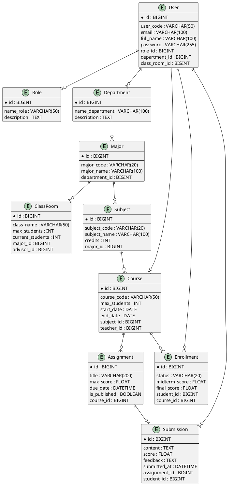
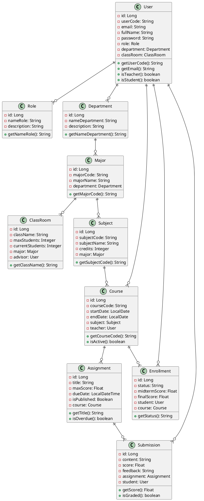
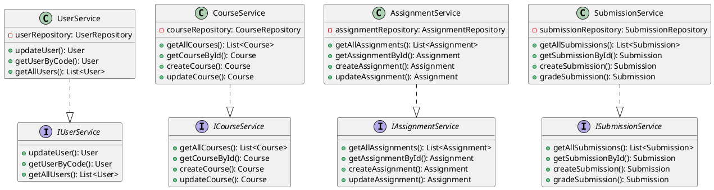
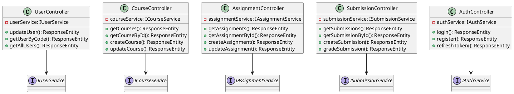
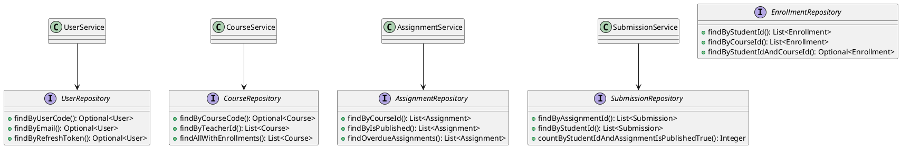

# Simple ERD for PlantUML Export

## ERD - Core Entities Only

```plantuml
@startuml LMS_ERD_Simple
entity User {
  * id : BIGINT
  --
  user_code : VARCHAR(50)
  email : VARCHAR(100)
  full_name : VARCHAR(100)
  password : VARCHAR(255)
  role_id : BIGINT
  department_id : BIGINT
  class_room_id : BIGINT
}

entity Role {
  * id : BIGINT
  --
  name_role : VARCHAR(50)
  description : TEXT
}

entity Department {
  * id : BIGINT
  --
  name_department : VARCHAR(100)
  description : TEXT
}

entity Major {
  * id : BIGINT
  --
  major_code : VARCHAR(20)
  major_name : VARCHAR(100)
  department_id : BIGINT
}

entity ClassRoom {
  * id : BIGINT
  --
  class_name : VARCHAR(50)
  max_students : INT
  current_students : INT
  major_id : BIGINT
  advisor_id : BIGINT
}

entity Subject {
  * id : BIGINT
  --
  subject_code : VARCHAR(20)
  subject_name : VARCHAR(100)
  credits : INT
  major_id : BIGINT
}

entity Course {
  * id : BIGINT
  --
  course_code : VARCHAR(50)
  max_students : INT
  start_date : DATE
  end_date : DATE
  subject_id : BIGINT
  teacher_id : BIGINT
}

entity Enrollment {
  * id : BIGINT
  --
  status : VARCHAR(20)
  midterm_score : FLOAT
  final_score : FLOAT
  student_id : BIGINT
  course_id : BIGINT
}

entity Assignment {
  * id : BIGINT
  --
  title : VARCHAR(200)
  max_score : FLOAT
  due_date : DATETIME
  is_published : BOOLEAN
  course_id : BIGINT
}

entity Submission {
  * id : BIGINT
  --
  content : TEXT
  score : FLOAT
  feedback : TEXT
  submitted_at : DATETIME
  assignment_id : BIGINT
  student_id : BIGINT
}

User ||--o{ Role
User ||--o{ Department
Department ||--o{ Major
Major ||--o{ ClassRoom
Major ||--o{ Subject
Subject ||--o{ Course
User ||--o{ Course
Course ||--o{ Enrollment
User ||--o{ Enrollment
Course ||--o{ Assignment
Assignment ||--o{ Submission
User ||--o{ Submission

@enduml
```

## Class Diagram - Entity Layer Only

```plantuml
@startuml LMS_Class_Simple
class User {
  -id: Long
  -userCode: String
  -email: String
  -fullName: String
  -password: String
  -role: Role
  -department: Department
  -classRoom: ClassRoom
  +getUserCode(): String
  +getEmail(): String
  +isTeacher(): boolean
  +isStudent(): boolean
}

class Role {
  -id: Long
  -nameRole: String
  -description: String
  +getNameRole(): String
}

class Department {
  -id: Long
  -nameDepartment: String
  -description: String
  +getNameDepartment(): String
}

class Major {
  -id: Long
  -majorCode: String
  -majorName: String
  -department: Department
  +getMajorCode(): String
}

class ClassRoom {
  -id: Long
  -className: String
  -maxStudents: Integer
  -currentStudents: Integer
  -major: Major
  -advisor: User
  +getClassName(): String
}

class Subject {
  -id: Long
  -subjectCode: String
  -subjectName: String
  -credits: Integer
  -major: Major
  +getSubjectCode(): String
}

class Course {
  -id: Long
  -courseCode: String
  -startDate: LocalDate
  -endDate: LocalDate
  -subject: Subject
  -teacher: User
  +getCourseCode(): String
  +isActive(): boolean
}

class Enrollment {
  -id: Long
  -status: String
  -midtermScore: Float
  -finalScore: Float
  -student: User
  -course: Course
  +getStatus(): String
}

class Assignment {
  -id: Long
  -title: String
  -maxScore: Float
  -dueDate: LocalDateTime
  -isPublished: Boolean
  -course: Course
  +getTitle(): String
  +isOverdue(): boolean
}

class Submission {
  -id: Long
  -content: String
  -score: Float
  -feedback: String
  -assignment: Assignment
  -student: User
  +getScore(): Float
  +isGraded(): boolean
}

User ||--o{ Role
User ||--o{ Department
Department ||--o{ Major
Major ||--o{ ClassRoom
Major ||--o{ Subject
Subject ||--o{ Course
User ||--o{ Course
Course ||--o{ Enrollment
User ||--o{ Enrollment
Course ||--o{ Assignment
Assignment ||--o{ Submission
User ||--o{ Submission

@enduml
```

## Service Layer Architecture

```plantuml
@startuml LMS_Service_Layer
interface IUserService {
  +updateUser(): User
  +getUserByCode(): User
  +getAllUsers(): List<User>
}

interface ICourseService {
  +getAllCourses(): List<Course>
  +getCourseById(): Course
  +createCourse(): Course
  +updateCourse(): Course
}

interface IAssignmentService {
  +getAllAssignments(): List<Assignment>
  +getAssignmentById(): Assignment
  +createAssignment(): Assignment
  +updateAssignment(): Assignment
}

interface ISubmissionService {
  +getAllSubmissions(): List<Submission>
  +getSubmissionById(): Submission
  +createSubmission(): Submission
  +gradeSubmission(): Submission
}

class UserService {
  -userRepository: UserRepository
  +updateUser(): User
  +getUserByCode(): User
  +getAllUsers(): List<User>
}

class CourseService {
  -courseRepository: CourseRepository
  +getAllCourses(): List<Course>
  +getCourseById(): Course
  +createCourse(): Course
  +updateCourse(): Course
}

class AssignmentService {
  -assignmentRepository: AssignmentRepository
  +getAllAssignments(): List<Assignment>
  +getAssignmentById(): Assignment
  +createAssignment(): Assignment
  +updateAssignment(): Assignment
}

class SubmissionService {
  -submissionRepository: SubmissionRepository
  +getAllSubmissions(): List<Submission>
  +getSubmissionById(): Submission
  +createSubmission(): Submission
  +gradeSubmission(): Submission
}

UserService ..|> IUserService
CourseService ..|> ICourseService
AssignmentService ..|> IAssignmentService
SubmissionService ..|> ISubmissionService

@enduml
```

## Controller Layer

```plantuml
@startuml LMS_Controller_Layer
class UserController {
  -userService: IUserService
  +updateUser(): ResponseEntity
  +getUserByCode(): ResponseEntity
  +getAllUsers(): ResponseEntity
}

class CourseController {
  -courseService: ICourseService
  +getCourses(): ResponseEntity
  +getCourseById(): ResponseEntity
  +createCourse(): ResponseEntity
  +updateCourse(): ResponseEntity
}

class AssignmentController {
  -assignmentService: IAssignmentService
  +getAssignments(): ResponseEntity
  +getAssignmentById(): ResponseEntity
  +createAssignment(): ResponseEntity
  +updateAssignment(): ResponseEntity
}

class SubmissionController {
  -submissionService: ISubmissionService
  +getSubmissions(): ResponseEntity
  +getSubmissionById(): ResponseEntity
  +createSubmission(): ResponseEntity
  +gradeSubmission(): ResponseEntity
}

class AuthController {
  -authService: IAuthService
  +login(): ResponseEntity
  +register(): ResponseEntity
  +refreshToken(): ResponseEntity
}

interface IUserService
interface ICourseService
interface IAssignmentService
interface ISubmissionService
interface IAuthService

UserController --> IUserService
CourseController --> ICourseService
AssignmentController --> IAssignmentService
SubmissionController --> ISubmissionService
AuthController --> IAuthService

@enduml
```

## Repository Layer

```plantuml
@startuml LMS_Repository_Layer
interface UserRepository {
  +findByUserCode(): Optional<User>
  +findByEmail(): Optional<User>
  +findByRefreshToken(): Optional<User>
}

interface CourseRepository {
  +findByCourseCode(): Optional<Course>
  +findByTeacherId(): List<Course>
  +findAllWithEnrollments(): List<Course>
}

interface AssignmentRepository {
  +findByCourseId(): List<Assignment>
  +findByIsPublished(): List<Assignment>
  +findOverdueAssignments(): List<Assignment>
}

interface SubmissionRepository {
  +findByAssignmentId(): List<Submission>
  +findByStudentId(): List<Submission>
  +countByStudentIdAndAssignmentIsPublishedTrue(): Integer
}

interface EnrollmentRepository {
  +findByStudentId(): List<Enrollment>
  +findByCourseId(): List<Enrollment>
  +findByStudentIdAndCourseId(): Optional<Enrollment>
}

class UserService
class CourseService
class AssignmentService
class SubmissionService

UserService --> UserRepository
CourseService --> CourseRepository
AssignmentService --> AssignmentRepository
SubmissionService --> SubmissionRepository

@enduml
```
