# Use Case Diagrams for LMS (Learning Management System)

## System Overview Analysis
Based on the source code analysis, this LMS system supports the following main actors:
- **Student** (Sinh viên)
- **Teacher** (Giáo viên) 
- **Department Head** (Trưởng khoa)
- **Admin** (Quản trị viên)
- **Class Advisor** (Cố vấn học tập)

## Main Use Case Diagram

## Assignment Management Detailed Use Case Diagram

## Submission Management Detailed Use Case Diagram

```plantuml
@startuml "Submission Management Use Cases"
!theme plain

actor Student as "👨‍🎓\nStudent"
actor Teacher as "👩‍🏫\nTeacher"
actor System as "🤖\nAuto Grading\nSystem"

rectangle "Submission Management System" {
    
    package "Student Submission" {
        usecase (Submit Assignment) as UC_Submit
        usecase (Submit or Update) as UC_SubmitOrUpdate
        usecase (Update Submission) as UC_Update
        usecase (Delete Submission) as UC_Delete
        usecase (View My Submissions) as UC_ViewMine
        usecase (Check Submission Status) as UC_CheckStatus
        usecase (Get Unsubmitted Count) as UC_UnsubmittedCount
    }
    
    package "Teacher Grading" {
        usecase (Grade Submission) as UC_Grade
        usecase (View All Submissions) as UC_ViewAll
        usecase (Get Submission Statistics) as UC_Stats
        usecase (View Submission Details) as UC_ViewDetails
    }
    
    package "Auto Grading" {
        usecase (Auto Grade Overdue) as UC_AutoGrade
        usecase (Create Zero Submissions) as UC_CreateZero
        usecase (Check Overdue Assignments) as UC_CheckOverdue
    }
    
    package "File Management" {
        usecase (Upload Submission Files) as UC_UploadFiles
        usecase (Download Submission Files) as UC_DownloadFiles
        usecase (Delete Submission Files) as UC_DeleteFiles
    }
}

' Student relationships
Student --> UC_Submit
Student --> UC_SubmitOrUpdate
Student --> UC_Update
Student --> UC_Delete
Student --> UC_ViewMine
Student --> UC_CheckStatus
Student --> UC_UploadFiles
Student --> UC_DownloadFiles

' Teacher relationships
Teacher --> UC_Grade
Teacher --> UC_ViewAll
Teacher --> UC_Stats
Teacher --> UC_ViewDetails
Teacher --> UC_UnsubmittedCount
Teacher --> UC_DownloadFiles

' System relationships
System --> UC_AutoGrade
System --> UC_CheckOverdue

' Include relationships
UC_Submit ..> UC_UploadFiles : <<include>>
UC_Update ..> UC_UploadFiles : <<include>>
UC_SubmitOrUpdate ..> UC_Submit : <<extend>>
UC_SubmitOrUpdate ..> UC_Update : <<extend>>
UC_AutoGrade ..> UC_CreateZero : <<include>>
UC_AutoGrade ..> UC_CheckOverdue : <<include>>

@enduml
```

## User Authentication & Authorization Use Case Diagram

```plantuml
@startuml "Authentication Use Cases"
!theme plain

actor User as "👤\nUser"
actor Student as "👨‍🎓\nStudent"
actor Teacher as "👩‍🏫\nTeacher"
actor Admin as "🔧\nAdmin"

rectangle "Authentication System" {
    
    package "Core Authentication" {
        usecase (Login) as UC_Login
        usecase (Logout) as UC_Logout
        usecase (Refresh Token) as UC_Refresh
        usecase (Get Account Info) as UC_Account
    }
    
    package "Session Management" {
        usecase (Validate Token) as UC_Validate
        usecase (Generate Token) as UC_Generate
        usecase (Revoke Token) as UC_Revoke
    }
    
    package "Authorization" {
        usecase (Check Student Permission) as UC_StudentPerm
        usecase (Check Teacher Permission) as UC_TeacherPerm
        usecase (Check Admin Permission) as UC_AdminPerm
        usecase (Role-based Access Control) as UC_RBAC
    }
}

' User relationships
User --> UC_Login
User --> UC_Logout
User --> UC_Refresh
User --> UC_Account

Student --|> User
Teacher --|> User
Admin --|> User

' Internal system relationships
UC_Login ..> UC_Generate : <<include>>
UC_Login ..> UC_RBAC : <<include>>
UC_Refresh ..> UC_Validate : <<include>>
UC_Refresh ..> UC_Generate : <<include>>
UC_Logout ..> UC_Revoke : <<include>>

UC_RBAC ..> UC_StudentPerm : <<extend>>
UC_RBAC ..> UC_TeacherPerm : <<extend>>
UC_RBAC ..> UC_AdminPerm : <<extend>>

@enduml
```

## Course & Enrollment Management Use Case Diagram

```plantuml
@startuml "Course Management Use Cases"
!theme plain

actor Student as "👨‍🎓\nStudent"
actor Teacher as "👩‍🏫\nTeacher"
actor Admin as "🔧\nAdmin"
actor DeptHead as "👨‍💼\nDepartment Head"

rectangle "Course Management System" {
    
    package "Course Operations" {
        usecase (Create Course) as UC_CreateCourse
        usecase (View Courses) as UC_ViewCourses
        usecase (Update Course) as UC_UpdateCourse
        usecase (Delete Course) as UC_DeleteCourse
        usecase (Get Course Statistics) as UC_CourseStats
    }
    
    package "Enrollment Management" {
        usecase (Enroll in Course) as UC_Enroll
        usecase (Drop from Course) as UC_Drop
        usecase (View Enrollments) as UC_ViewEnrollments
        usecase (Manage Class List) as UC_ManageClass
        usecase (View Student List) as UC_ViewStudents
    }
    
    package "Course Content" {
        usecase (View Course Details) as UC_CourseDetails
        usecase (Access Course Materials) as UC_Materials
        usecase (View Course Schedule) as UC_Schedule
    }
}

' Student relationships
Student --> UC_ViewCourses
Student --> UC_Enroll
Student --> UC_Drop
Student --> UC_ViewEnrollments
Student --> UC_CourseDetails
Student --> UC_Materials
Student --> UC_Schedule

' Teacher relationships
Teacher --> UC_CreateCourse
Teacher --> UC_ViewCourses
Teacher --> UC_UpdateCourse
Teacher --> UC_ManageClass
Teacher --> UC_ViewStudents
Teacher --> UC_CourseDetails
Teacher --> UC_CourseStats

' Admin relationships
Admin --> UC_CreateCourse
Admin --> UC_ViewCourses
Admin --> UC_UpdateCourse
Admin --> UC_DeleteCourse
Admin --> UC_ViewEnrollments
Admin --> UC_ManageClass
Admin --> UC_CourseStats

' Department Head relationships
DeptHead --> UC_ViewCourses
DeptHead --> UC_ViewEnrollments
DeptHead --> UC_CourseStats
DeptHead --> UC_ViewStudents

@enduml
```

## Lesson Management Use Case Diagram

```plantuml
@startuml "Lesson Management Use Cases"
!theme plain

actor Student as "👨‍🎓\nStudent"
actor Teacher as "👩‍🏫\nTeacher"

rectangle "Lesson Management System" {
    
    package "Lesson CRUD" {
        usecase (Create Lesson) as UC_Create
        usecase (Create Lesson with Files) as UC_CreateWithFiles
        usecase (View Lesson) as UC_View
        usecase (Update Lesson) as UC_Update
        usecase (Update Lesson with Files) as UC_UpdateWithFiles
        usecase (Delete Lesson) as UC_Delete
        usecase (Publish Lesson) as UC_Publish
    }
    
    package "Lesson Content" {
        usecase (Upload Lesson Materials) as UC_Upload
        usecase (Download Materials) as UC_Download
        usecase (View Lesson Content) as UC_ViewContent
        usecase (Search Lessons) as UC_Search
    }
    
    package "Lesson Organization" {
        usecase (Order Lessons) as UC_Order
        usecase (Categorize Lessons) as UC_Categorize
        usecase (Filter Lessons) as UC_Filter
    }
}

' Teacher relationships
Teacher --> UC_Create
Teacher --> UC_CreateWithFiles
Teacher --> UC_View
Teacher --> UC_Update
Teacher --> UC_UpdateWithFiles
Teacher --> UC_Delete
Teacher --> UC_Publish
Teacher --> UC_Upload
Teacher --> UC_Download
Teacher --> UC_Order
Teacher --> UC_Categorize

' Student relationships
Student --> UC_View
Student --> UC_ViewContent
Student --> UC_Download
Student --> UC_Search
Student --> UC_Filter

' Include relationships
UC_CreateWithFiles ..> UC_Upload : <<include>>
UC_UpdateWithFiles ..> UC_Upload : <<include>>

@enduml
```

## System Integration & Monitoring Use Case Diagram

## Use Case Descriptions

### Core Use Cases

#### UC_Login - User Login
**Actors**: All Users  
**Description**: Authenticate user with username/password and generate JWT token  
**Preconditions**: User has valid credentials  
**Postconditions**: User is authenticated and receives access token  

#### UC_Submit - Submit Assignment
**Actors**: Student  
**Description**: Student submits assignment with optional file attachments  
**Preconditions**: Student is enrolled in course, assignment is published  
**Postconditions**: Submission is created and stored in system  

#### UC_GradeSubmission - Grade Student Submission
**Actors**: Teacher  
**Description**: Teacher reviews and grades student submission  
**Preconditions**: Student has submitted assignment, teacher owns the course  
**Postconditions**: Submission is graded with score and feedback  

#### UC_AutoGrade - Automatic Grading
**Actors**: System  
**Description**: System automatically assigns zero score to overdue unsubmitted assignments  
**Preconditions**: Assignment is overdue and doesn't allow late submission  
**Postconditions**: Zero submissions created for students who didn't submit  

#### UC_CreateAssignment - Create Assignment
**Actors**: Teacher  
**Description**: Teacher creates new assignment for course  
**Preconditions**: Teacher owns the course  
**Postconditions**: Assignment is created and can be published  

### Advanced Use Cases

#### UC_SubmitOrUpdate - Unified Submission
**Actors**: Student  
**Description**: Automatically determines whether to create new or update existing submission  
**Preconditions**: Student is enrolled in course  
**Postconditions**: Submission is created or updated appropriately  

#### UC_UnsubmittedCount - Get Unsubmitted Assignment Count
**Actors**: Teacher, Student, Advisor  
**Description**: Get count of assignments student can still submit  
**Preconditions**: Valid student ID provided  
**Postconditions**: Returns count of submittable assignments  

#### UC_SubmissionStats - Submission Statistics
**Actors**: Teacher, Admin, Department Head  
**Description**: Get comprehensive statistics about assignment submissions  
**Preconditions**: User has permission to view statistics  
**Postconditions**: Returns detailed submission analytics  

---

These use case diagrams provide a comprehensive view of the LMS system functionality based on the source code analysis. The system supports complex workflows for course management, assignment handling, submission processing, and automated grading.
