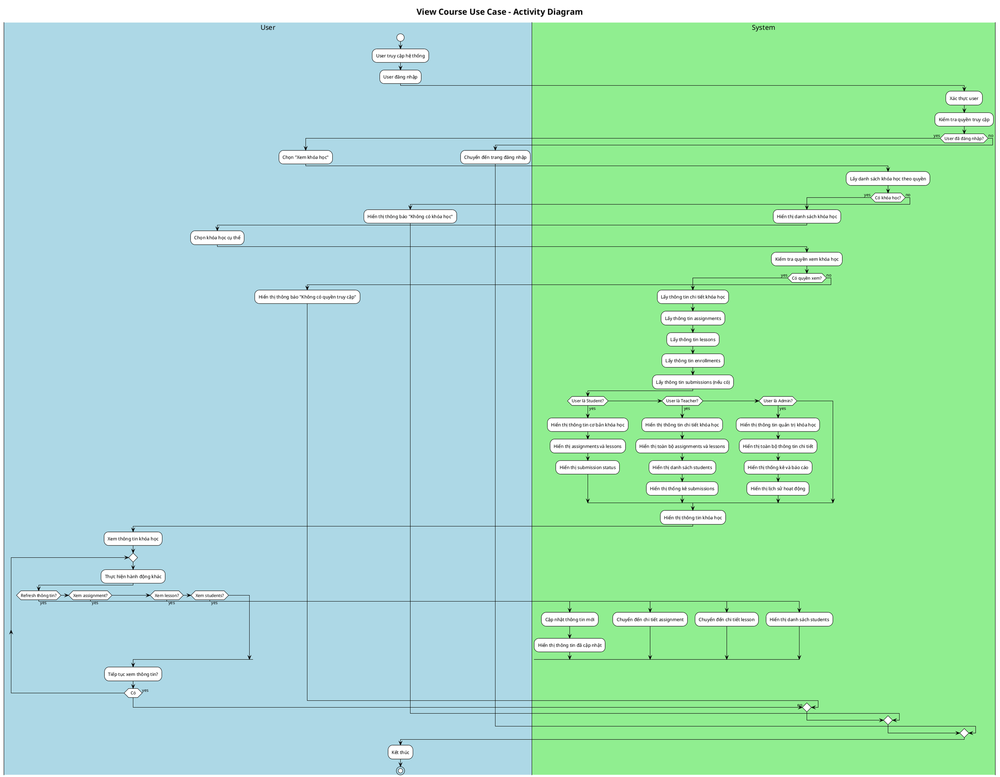
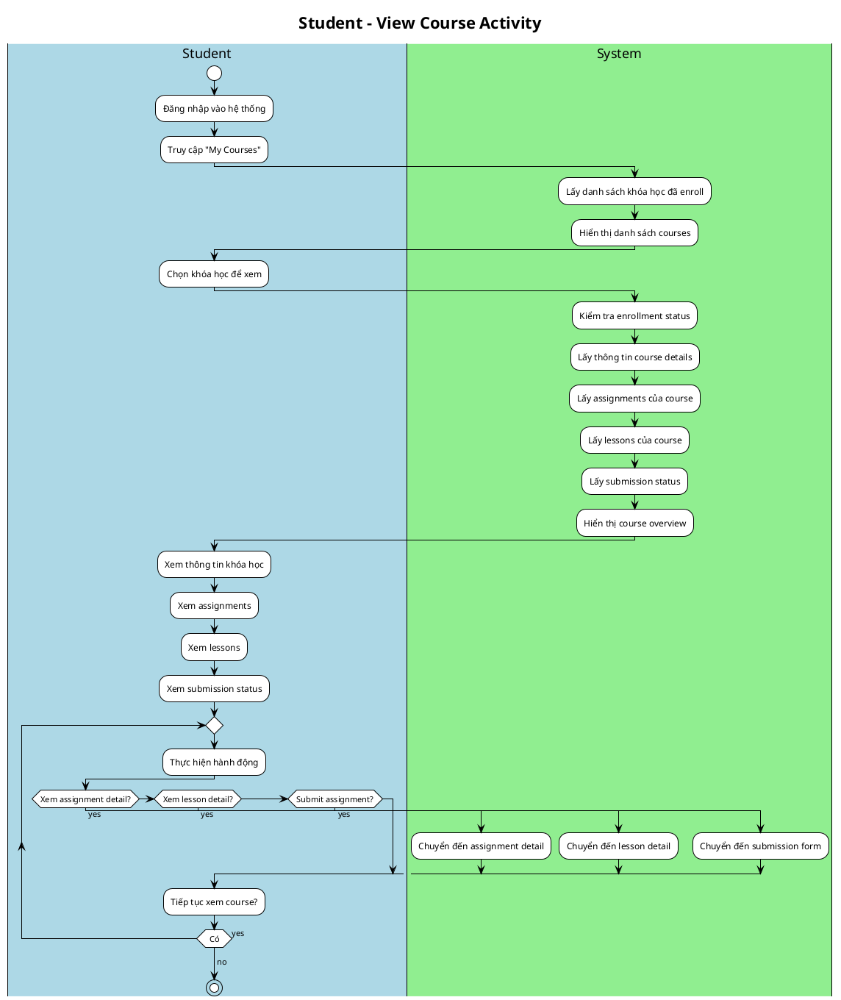
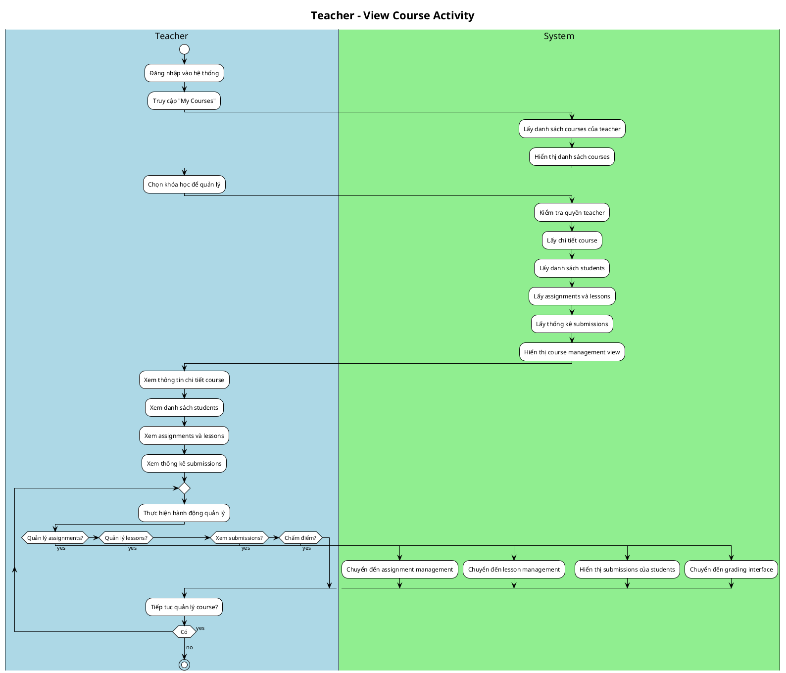
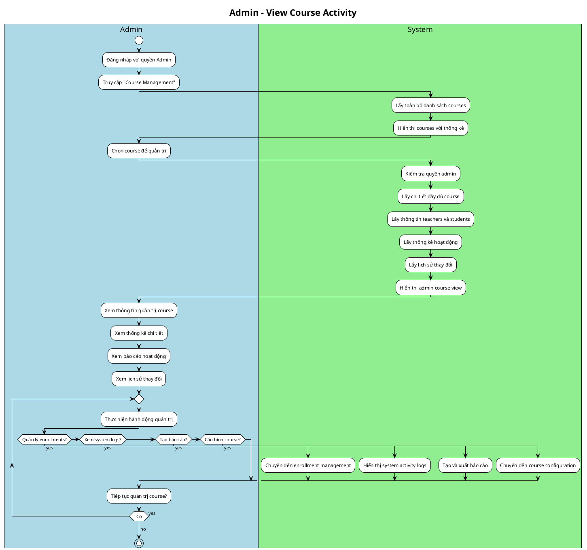

# Activity Diagram: View Course Use Case

## Overview
Activity diagram cho use case "Xem khóa học" (View Course) với các actor: Admin, Teacher, Student.

## Activity Diagram - View Course Use Case

### Complete Activity Diagram

### Simplified Activity Diagram by Actor

#### 1. Student View Course Activity

#### 2. Teacher View Course Activity

#### 3. Admin View Course Activity

### Business Rules & Constraints

1. **Authentication Required**: Tất cả users phải đăng nhập trước khi xem course
2. **Authorization Check**: Kiểm tra quyền truy cập dựa trên role
3. **Data Filtering**: Dữ liệu hiển thị được filter theo quyền của user
4. **Performance**: Lazy loading cho data lớn
5. **Error Handling**: Xử lý lỗi khi không có quyền hoặc course không tồn tại

### Data Access Patterns

- **Student**: Chỉ xem courses đã enroll, limited information
- **Teacher**: Xem courses được assign, full management view
- **Admin**: Xem tất cả courses, full administrative view

### Security Considerations

- Authentication validation
- Role-based access control
- Data filtering by permissions
- Audit trail for admin actions

## Usage Notes

1. **PlantUML**: Copy từng section riêng biệt để tránh lỗi "Request header too large"
2. **Draw.io**: Có thể import qua PlantUML plugin hoặc vẽ manual
3. **Customization**: Có thể điều chỉnh swim lanes và colors theo yêu cầu
