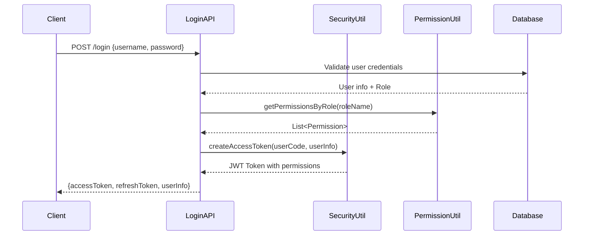
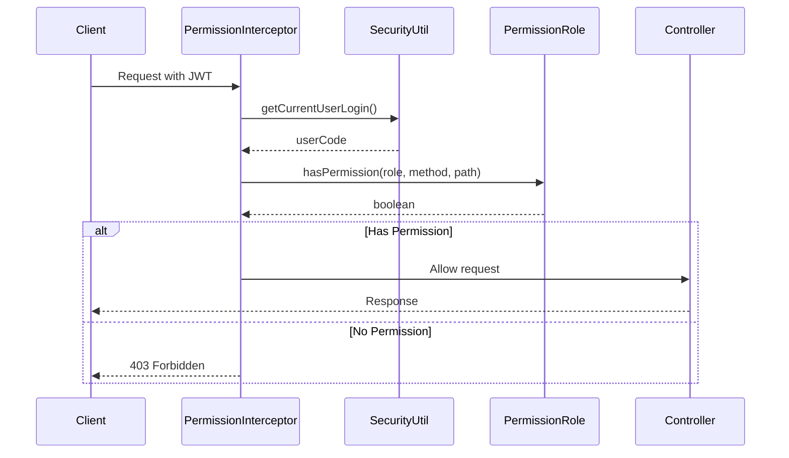

# Tài liệu Hệ thống Bảo mật LMS

## 📋 Tổng quan

Hệ thống LMS (Learning Management System) sử dụng một kiến trúc bảo mật hiện đại với các thành phần chính:

- **JWT (JSON Web Token)** - Xác thực và ủy quyền
- **OAuth2 Resource Server** - Quản lý tài nguyên bảo mật
- **Dynamic Permission System** - Phân quyền động dựa trên enum
- **Role-Based Access Control (RBAC)** - Kiểm soát truy cập theo vai trò
- **Custom Authorization Interceptor** - Interceptor tùy chỉnh cho việc phân quyền

---

## 🔐 1. Kiến trúc Authentication (Xác thực)

### 1.1 JWT Token Management

#### **SecurityUtil.java**
```java
@Service
public class SecurityUtil {
    
    // Tạo Access Token với thời gian sống 1 giờ
    public String createAccessToken(String userCode, ResLoginDTO.UserLogin dto) {
        List<String> listAuthority = PermissionUtil.getPermissionsByRole(dto.getRoleName());
        
        JwtClaimsSet claims = JwtClaimsSet.builder()
            .issuedAt(now)
            .expiresAt(validity)
            .subject(userCode)
            .claim("user", dto)
            .claim("permission", listAuthority) // Lưu trữ quyền động
            .build();
    }
    
    // Tạo Refresh Token với thời gian sống 7 ngày
    public String createRefreshToken(String userCode, ResLoginDTO dto) {
        // Logic tạo refresh token
    }
}
```

#### **Đặc điểm JWT:**
- **Algorithm:** RS256 (RSA Signature)
- **Access Token:** 1 giờ
- **Refresh Token:** 7 ngày
- **Claims:** `user`, `permission`, `sub`, `iat`, `exp`
- **Dynamic Permissions:** Quyền được load động từ enum dựa trên role

### 1.2 OAuth2 Resource Server Configuration

#### **SecurityConfiguration.java**
```java
@Configuration
@EnableWebSecurity
@EnableMethodSecurity(securedEnabled = true)
public class SecurityConfiguration {
    
    @Bean
    public SecurityFilterChain filterChain(HttpSecurity http) throws Exception {
        http
            .authorizeHttpRequests(authz -> authz
                .requestMatchers("/login", "/auth/refresh", "/health").permitAll()
                .anyRequest().authenticated()
            )
            .oauth2ResourceServer(oauth2 -> oauth2
                .jwt(jwt -> jwt
                    .decoder(jwtDecoder())
                    .jwtAuthenticationConverter(jwtAuthenticationConverter())
                )
            )
            .sessionManagement(session -> session
                .sessionCreationPolicy(SessionCreationPolicy.STATELESS)
            );
    }
}
```

#### **Đặc điểm OAuth2:**
- **Stateless:** Không lưu session
- **Resource Server:** Chỉ verify JWT token
- **JWT Decoder:** Tự động decode và validate
- **Authentication Converter:** Chuyển đổi JWT thành Authentication object

---

## 🛡️ 2. Hệ thống Authorization (Phân quyền)

### 2.1 Dynamic Permission System

#### **Permission.java Enum**
```java
public enum Permission {
    // User Management
    CREATE_USER("CREATE_USER", HttpMethod.POST, "/admin/users", "Tạo người dùng mới"),
    VIEW_ALL_USERS("VIEW_ALL_USERS", HttpMethod.GET, "/admin/users", "Xem danh sách người dùng"),
    
    // Course Management
    CREATE_COURSE("CREATE_COURSE", HttpMethod.POST, "/admin/courses", "Tạo khóa học mới"),
    VIEW_COURSE_DETAILS("VIEW_COURSE_DETAILS", HttpMethod.GET, "/admin/courses/{courseId}/details", "Xem chi tiết khóa học"),
    
    // Lesson Management
    CREATE_LESSON("CREATE_LESSON", HttpMethod.POST, "/api/lessons/create", "Tạo bài học mới"),
    DELETE_LESSON("DELETE_LESSON", HttpMethod.DELETE, "/api/lessons/{lessonId}", "Xóa bài học"),
    
    // Assignment Management
    CREATE_ASSIGNMENT("CREATE_ASSIGNMENT", HttpMethod.POST, "/api/assignments/create-with-files", "Tạo bài tập"),
    GRADE_SUBMISSION("GRADE_SUBMISSION", HttpMethod.POST, "/api/submissions/{submissionId}/grade", "Chấm điểm"),
    
    // Authentication
    LOGIN("LOGIN", HttpMethod.POST, "/login", "Đăng nhập"),
    VIEW_ACCOUNT("VIEW_ACCOUNT", HttpMethod.GET, "/auth/account", "Xem thông tin tài khoản");
    
    // Method kiểm tra pattern matching
    public boolean matches(HttpMethod method, String path) {
        if (!this.httpMethod.equals(method)) {
            return false;
        }
        
        String regex = this.endpointPattern
            .replaceAll("\\{[^}]+\\}", "[^/]+")  // {id} -> [^/]+
            .replaceAll("\\*", ".*");           // * -> .*
            
        return path.matches(regex);
    }
}
```

#### **PermissionRole.java Enum**
```java
public enum PermissionRole {
    
    ADMIN(Arrays.asList(
        // Full access - tất cả permissions
        Permission.CREATE_USER,
        Permission.VIEW_ALL_USERS,
        Permission.CREATE_COURSE,
        Permission.DELETE_COURSE,
        // ... tất cả permissions
    )),
    
    TEACHER(Arrays.asList(
        // Course Management - Limited
        Permission.VIEW_COURSES_BY_TEACHER,
        Permission.VIEW_COURSE_FULL_DETAILS,
        Permission.UPDATE_STUDENT_SCORES,
        
        // Lesson Management - Full
        Permission.CREATE_LESSON,
        Permission.UPDATE_LESSON,
        Permission.DELETE_LESSON,
        
        // Assignment Management - Full
        Permission.CREATE_ASSIGNMENT,
        Permission.GRADE_SUBMISSION,
        Permission.DELETE_ASSIGNMENT,
        
        // Authentication
        Permission.LOGIN,
        Permission.VIEW_ACCOUNT
    )),
    
    STUDENT(Arrays.asList(
        // Course Access - Read only
        Permission.VIEW_COURSES_BY_STUDENT,
        Permission.VIEW_STUDENT_COURSE_DETAILS,
        
        // Lesson Access - Read only
        Permission.VIEW_LESSON,
        
        // Assignment Access - Read and Submit
        Permission.VIEW_ASSIGNMENT,
        Permission.SUBMIT_ASSIGNMENT,
        
        // Authentication
        Permission.LOGIN,
        Permission.VIEW_ACCOUNT
    ));
    
    // Method kiểm tra quyền động
    public static boolean hasPermission(String roleName, HttpMethod method, String path) {
        List<Permission> permissions = getPermissionsForRole(roleName);
        return permissions.stream()
            .anyMatch(permission -> permission.matches(method, path));
    }
}
```

### 2.2 Authorization Service

#### **AuthorizationService.java**
```java
@Service
public class AuthorizationService {
    
    // Kiểm tra quyền cơ bản
    public boolean hasPermission(String userRole, HttpMethod method, String requestPath) {
        String normalizedRole = normalizeRoleName(userRole);
        boolean hasAccess = PermissionRole.hasPermission(normalizedRole, method, requestPath);
        
        if (!hasAccess) {
            log.warn("Access denied - Role: {}, Method: {}, Path: {}", 
                    normalizedRole, method, requestPath);
        }
        
        return hasAccess;
    }
    
    // Kiểm tra quyền với context (cho Student)
    public boolean hasPermissionWithContext(String userRole, Long userId, 
                                          HttpMethod method, String requestPath, Long targetUserId) {
        if (!hasPermission(userRole, method, requestPath)) {
            return false;
        }
        
        // Student chỉ có thể truy cập dữ liệu của chính mình
        if ("STUDENT".equals(normalizeRoleName(userRole))) {
            return checkStudentDataAccess(userId, requestPath, targetUserId);
        }
        
        return true;
    }
    
    // Kiểm tra endpoint có cần authentication không
    public boolean requiresAuthentication(String requestPath) {
        String[] publicEndpoints = {"/login", "/health", "/error", "/favicon.ico"};
        return !Arrays.stream(publicEndpoints)
            .anyMatch(endpoint -> requestPath.startsWith(endpoint));
    }
}
```

### 2.3 Permission Interceptor

#### **PermissionInterceptor.java**
```java
@Component
@AllArgsConstructor
public class PermissionInterceptor implements HandlerInterceptor {
    
    @Override
    public boolean preHandle(HttpServletRequest request, HttpServletResponse response, 
                           Object handler) throws Exception {
        
        String requestURI = request.getRequestURI();
        String httpMethod = request.getMethod();
        
        // Kiểm tra authentication
        String userCode = SecurityUtil.getCurrentUserLogin().orElse("");
        if (userCode.isEmpty()) {
            sendErrorResponse(response, HttpStatus.UNAUTHORIZED, "Cần đăng nhập");
            return false;
        }
        
        // Lấy thông tin user và role
        User user = userService.getUserByUserCode(userCode);
        String roleName = user.getRole().getNameRole();
        
        // Kiểm tra quyền truy cập
        boolean hasPermission = PermissionRole.hasPermission(roleName, 
                                HttpMethod.valueOf(httpMethod), requestURI);
        
        if (!hasPermission) {
            sendErrorResponse(response, HttpStatus.FORBIDDEN, "Không có quyền truy cập");
            return false;
        }
        
        return true;
    }
    
    // Trả về JSON response theo format CustomResponse
    private void sendErrorResponse(HttpServletResponse response, HttpStatus status, 
                                 String message) throws IOException {
        response.setStatus(status.value());
        response.setContentType("application/json");
        
        CustomResponse<Object> errorResponse = new CustomResponse<>();
        errorResponse.setStatusCode(status.value());
        errorResponse.setMessage(message);
        
        ObjectMapper mapper = new ObjectMapper();
        response.getWriter().write(mapper.writeValueAsString(errorResponse));
    }
}
```

---

## 🔄 3. Flow Xác thực và Phân quyền

### 3.1 Authentication Flow



### 3.2 Authorization Flow



## 🔧 5. Cấu hình Bảo mật

### 5.1 JWT Configuration

```java
@Configuration
public class JwtConfiguration {
    
    @Value("${jwt.base64-secret}")
    private String jwtKey;
    
    @Value("${jwt.access-token-validity-in-seconds}")
    private long accessTokenExpiration;
    
    @Value("${jwt.refresh-token-validity-in-seconds}")
    private long refreshTokenExpiration;
    
    @Bean
    public JwtDecoder jwtDecoder() {
        NimbusJwtDecoder jwtDecoder = NimbusJwtDecoder
            .withSecretKey(getSecretKey())
            .macAlgorithm(MacAlgorithm.HS512)
            .build();
        return token -> {
            try {
                return jwtDecoder.decode(token);
            } catch (JwtException e) {
                throw new BadJwtException("Invalid JWT token", e);
            }
        };
    }
}
```

### 5.2 CORS Configuration

```java
@Configuration
public class CorsConfig {
    
    @Bean
    public CorsConfigurationSource corsConfigurationSource() {
        CorsConfiguration configuration = new CorsConfiguration();
        configuration.setAllowedOriginPatterns(Arrays.asList("*"));
        configuration.setAllowedMethods(Arrays.asList("GET", "POST", "PUT", "DELETE", "OPTIONS"));
        configuration.setAllowedHeaders(Arrays.asList("*"));
        configuration.setAllowCredentials(true);
        
        UrlBasedCorsConfigurationSource source = new UrlBasedCorsConfigurationSource();
        source.registerCorsConfiguration("/**", configuration);
        return source;
    }
}
```

---

## 📋 6. Tính năng Bảo mật Nâng cao

### 6.1 Context-Based Authorization

```java
// Student chỉ có thể truy cập dữ liệu của chính mình
public boolean hasPermissionWithContext(String userRole, Long userId, 
                                      HttpMethod method, String requestPath, Long targetUserId) {
    if (!hasPermission(userRole, method, requestPath)) {
        return false;
    }
    
    if ("STUDENT".equals(normalizeRoleName(userRole))) {
        return checkStudentDataAccess(userId, requestPath, targetUserId);
    }
    
    return true;
}
```

### 6.2 Dynamic Permission Loading

```java
// Quyền được load động từ database hoặc enum
public String createAccessToken(String userCode, ResLoginDTO.UserLogin dto) {
    List<String> listAuthority = PermissionUtil.getPermissionsByRole(dto.getRoleName());
    
    JwtClaimsSet claims = JwtClaimsSet.builder()
        .claim("permission", listAuthority) // Dynamic permissions
        .build();
}
```

### 6.3 Endpoint Pattern Matching

```java
public boolean matches(HttpMethod method, String path) {
    if (!this.httpMethod.equals(method)) {
        return false;
    }
    
    // Regex pattern matching for dynamic endpoints
    String regex = this.endpointPattern
        .replaceAll("\\{[^}]+\\}", "[^/]+")  // {id} -> [^/]+
        .replaceAll("\\*", ".*");           // * -> .*
        
    return path.matches(regex);
}
```

---

## 🚀 7. Deployment và Monitoring

### 7.1 Security Headers

```java
@Configuration
public class SecurityHeadersConfig {
    
    @Bean
    public SecurityFilterChain securityHeaders(HttpSecurity http) throws Exception {
        http.headers(headers -> headers
            .frameOptions().deny()
            .contentTypeOptions().and()
            .httpStrictTransportSecurity(hstsConfig -> hstsConfig
                .maxAgeInSeconds(31536000)
                .includeSubdomains(true)
            )
        );
        return http.build();
    }
}
```

### 7.2 Logging và Monitoring

```java
@Component
public class SecurityEventListener {
    
    @EventListener
    public void onAuthenticationSuccess(AuthenticationSuccessEvent event) {
        log.info("User {} logged in successfully", event.getAuthentication().getName());
    }
    
    @EventListener
    public void onAuthenticationFailure(AbstractAuthenticationFailureEvent event) {
        log.warn("Authentication failed for user: {}", event.getAuthentication().getName());
    }
}
```

---

## 📖 8. Hướng dẫn Sử dụng

### 8.1 Thêm Permission mới

1. **Thêm vào Permission enum:**
```java
NEW_PERMISSION("NEW_PERMISSION", HttpMethod.GET, "/api/new-endpoint", "Mô tả quyền mới")
```

2. **Gán cho Role trong PermissionRole:**
```java
TEACHER(Arrays.asList(
    // ...existing permissions...
    Permission.NEW_PERMISSION
))
```

3. **Tạo API endpoint tương ứng:**
```java
@GetMapping("/api/new-endpoint")
public ResponseEntity<?> newEndpoint() {
    // Implementation
}
```

### 8.2 Test Authorization

```java
@Test
public void testTeacherCanAccessLessonAPI() {
    // Given
    String role = "TEACHER";
    HttpMethod method = HttpMethod.GET;
    String path = "/api/lessons/123";
    
    // When
    boolean hasPermission = PermissionRole.hasPermission(role, method, path);
    
    // Then
    assertTrue(hasPermission);
}
```

---

## 🔒 9. Best Practices

### 9.1 Security Best Practices

1. **JWT Token Management:**
   - Sử dụng short-lived access token (1 giờ)
   - Implement refresh token rotation
   - Store refresh token securely

2. **Permission Design:**
   - Principle of least privilege
   - Granular permissions thay vì coarse-grained
   - Regular permission audit

3. **Error Handling:**
   - Không expose sensitive information
   - Consistent error responses
   - Proper logging for security events

### 9.2 Performance Optimization

1. **Caching:**
   - Cache user permissions
   - Cache JWT validation results
   - Use Redis for session management

2. **Database Optimization:**
   - Index trên user_id, role_id
   - Optimize permission queries
   - Use connection pooling

---

## 📚 10. Tài liệu Tham khảo

### 10.1 Dependencies

```xml
<dependency>
    <groupId>org.springframework.boot</groupId>
    <artifactId>spring-boot-starter-security</artifactId>
</dependency>
<dependency>
    <groupId>org.springframework.boot</groupId>
    <artifactId>spring-boot-starter-oauth2-resource-server</artifactId>
</dependency>
<dependency>
    <groupId>org.springframework.security</groupId>
    <artifactId>spring-security-jwt</artifactId>
</dependency>
```

### 10.2 Configuration Properties

```properties
# JWT Configuration
jwt.base64-secret=your-secret-key
jwt.access-token-validity-in-seconds=3600
jwt.refresh-token-validity-in-seconds=604800

# Security Configuration
spring.security.oauth2.resourceserver.jwt.issuer-uri=http://localhost:8080
```

---

## 🎯 Kết luận

Hệ thống bảo mật LMS được thiết kế với:

✅ **Scalability:** Dễ dàng mở rộng permissions và roles  
✅ **Maintainability:** Code rõ ràng, dễ bảo trì  
✅ **Security:** Tuân thủ best practices bảo mật  
✅ **Performance:** Tối ưu hóa cho hiệu suất cao  
✅ **Flexibility:** Hỗ trợ dynamic permission loading  

Hệ thống này đảm bảo tính bảo mật cao cho ứng dụng LMS với khả năng mở rộng và bảo trì tốt.
